# AISD_EXAM

## Билет 1 Методологии программирования. Понятие алгоритма. Способы записи алгоритмов.

Методологии
	
1. Хаотическое – написание кода без предварительного проектирования.

2. Структурное – использование последовательности, ветвлений, циклов; отказ от goto.

3. Объектно-ориентированное (ООП) – инкапсуляция, наследование, полиморфизм, абстракция (кто питон учил, те запомнили уже)

Понятие алгоритма
	
• Формула Вирта: Программа = Алгоритм + Данные

• Определение: корректно определённая вычислительная процедура, на вход которой подаётся величина (или набор), а результатом является выходная величина (или набор).

• Схема: Входные данные → [Алгоритм] → Выходные данные

• Пример: задача сортировки {a₁...aₙ} → {a₁'≤a₂'≤...≤aₙ'}

Эффективность
	
t = k / v, где k – количество операций, v – быстродействие процессора.

Сравнение:
• Вставками: k₁ = c₁·n², c₁=2, v₁=10⁹ → при n=10⁹ ≈ 2000 сек
• Слиянием: k₂ = c₂·n·log₂n, c₂=50, v₂=10⁷ → при n=10 ≈ 2,3 дня

Способы записи
	
1. Словесное описание
2. Схема алгоритма (блок-схема)
3. Псевдокод
4. Программа на ЯП

## Билет 2. Уровни представления информации. Понятие абстрактных (логических) структурданных. Основные операции.

Уровень

1. Интуитивный - восприятие человеком (например, «список покупок»)

2. Абстрактный (логический) - математическая модель.
Логическая структура = Множество элементов + Связи между ними
3. Конкретный.
Физическое отображение в памяти ЭВМ (вектор, список, сеть)

 Логическая структура данных

    Динамическое множество состоит из объектов.

    Каждый объект содержит:
        Ключевое поле (уникальный идентификатор)
        Сопутствующие данные (информация)
        Поля связей (указатели на другие объекты)

Классификация логических структур

Массивы → Строки → Стеки/Очереди/Деки → Таблицы → Деревья → Графы

️
 Основные операции

    Search(S, k) - Поиск элемента по ключу
	Minimum(S), Maximum(S) - Поиск мин/макс ключа
    Successor(S, x), Predecessor(S, x) - Следующий/предыдущий элемент
    Insert(S, x) - Вставка нового элемента 
    Delete(S, x) - Удаление элемента
S – динамическое множество, x – указатель на элемент, k – значение ключа
	
## Билет 3. Конкретные структуры данных. Отображение структуры данных в памяти вектором.

Вектор - Непрерывная область памяти ЭВМ

Параметры:

Базовый адрес, размер одного элемента, количество элементов

Доступ - по индексу за O(1)
 см билет 2

## Билет 4. Конкретные структуры данных. Отображение структуры данных в памяти списком. Типы списков.

Элемент списка
	
Информация + Поле связи (указатель на следующий/предыдущий элемент)

Доступ:	
Последовательный, по указателям (O(n) для i-го элемента)

Классификация списков

По структуре элемента : Односвязный (next), Двусвязный (prev, next)

По организации: Линейный (последний → NULL), Циклический (последний → первый)

По способу заданию: Указатель на начало (голову), Головной элемент (фиктивный узел)

Примеры комбинированных типов:

    Линейный односвязный список с головным элементом
    Циклический двусвязный список с головным элементом

Сеть: произвольные связи между элементами (графовая структура).

## Билет 5. Элементарные структуры данных: стек и очередь, представленные вектором.

Стек (LIFO) -last in first out

    Динамическая структура с одним концом.

    Реализация на векторе:
        Пуст: top = 0
        Запись: stack[top] = info; top = top + 1
        Полон: top == N
        Чтение: top = top - 1; info = stack[top]
        Пуст после чтения: top == 0

Cмотрите код

## Билет 6. Элементарные структуры данных: стек и очередь, представленные списком.

 Очередь (FIFO) - first int first out

    Динамическая структура с двумя концами (голова head, хвост tail).

    Реализация на векторе (циклический буфер):
        Пуста: head == tail (или n == 0)
        Запись: queue[tail] = info; tail = (tail + 1) % N
        Полна: head == tail (или n == N)
        Чтение: info = queue[head]; head = (head + 1) % N

    Использование % N позволяет эффективно переиспользовать освободившиеся ячейки без сдвигов.
    N- размер очереди

Стек на списке

    Вставка/извлечение всегда с головы (top).
    Push: x->next = top; top = x;
    Pop: x = top; top = top->next; x->next = NULL;
    Сложность: O(1), без необходимости сдвига памяти.

Очередь на линейном списке

    Вставка в хвост (tail), извлечение из головы (head).
    Пустая: head = NULL, tail = NULL

Очередь на циклическом списке

    Используется один указатель tail. Начало очереди: head = tail->next.

Преимущество: постоянный доступ к обоим концам за O(1), экономия памяти (один указатель вместо двух)

## Билет 7. Таблицы: основные определения, классификация таблиц, способы отображения в памяти.

1. Определение

Таблица — это динамическое множество элементов, каждый из которых состоит из пары (Ключ, Информация).

    Ключ key — уникальное значение, идентифицирующее элемент.

    Информация  info — сопутствующие данные.

2. Основные операции

    Поиск (Search): найти элемент по ключу.

    Вставка (Insert): добавить новый элемент (если ключа нет).

    Удаление (Delete): убрать элемент по ключу.

3. Классификация таблиц


    Просматриваемые (неупорядоченные): элементы хранятся в порядке поступления, поиск только линейный.

    Упорядоченные: элементы отсортированы по ключу, возможен бинарный поиск.

    С вычисляемым входом (Хеш-таблицы): 
    
    адрес вычисляется функцией h(k).

        Прямая адресация: r(k) уникальна для каждого ключа.

        Перемешанные (Hash): возможны коллизии.

    Произвольного доступа: прямой доступ по индексу (массив).

4. Отображение в памяти (Слайды 3.4–3.7)

    Вектор (массив): непрерывная область памяти. Доступ по индексу O(1)

    Список: элементы связаны указателями. Доступ последовательный.

    Сеть: произвольные связи (граф).

## Билет 8. Просматриваемая таблица – вектор: определение, основные операции, особенности их реализации.

Суть: Элементы не сортируются. Хранятся в массиве.
Операции и реализации 

    Поиск (Search):
        Линейный просмотр от 0 до n−1
        Сложность: Θ(n).
    Вставка (Insert):
        Сначала Search (чтобы не было дубликатов).
        Если места нет → отказ.
        Иначе запись в конец: table[n] = new_elem, n = n + 1.
        Сложность: Θ(n) (доминирует поиск).
    Удаление (Delete):
        Найти элемент (индекс i).
        Заменить его последним элементом таблицы: table[i] = table[n-1].

        Уменьшить размер: n = n - 1.

        Важно: Порядок элементов нарушается, но это допустимо для просматриваемой таблицы.

        Сложность: Θ(n)

## Билет 9. Просматриваемая таблица – список: определение, основные операции, особенности их реализации.

Суть: Таблица реализована односвязным списком. Элементы не сортируются.

Операции

    Поиск:
        Линейный обход от head до NULL.
        Сложность: Θ(n)
    Вставка:
        Поиск дубликата.
        Вставка в начало списка (перед head), так как это O(1) после поиска.
        Сложность: Θ(n)
    Удаление:
        Найти элемент и предыдущий элемент.
        Перенаправить указатель:
         prev->next = cur->next.
        Освободить память cur.
        Сложность: Θ(n)

Код смотрите короче

## Билет 10. Упорядоченная таблица: определение, основные операции, особенности их реализации.

Суть: Ключи всегда отсортированы (k1<k2<⋯<kn)

Операции 

    Поиск:
        Бинарный поиск (деление отрезка пополам).
        Сложность: Θ(log⁡2 n)
    Вставка:
        Найти позицию вставки (чтобы не нарушить порядок).
        Сдвинуть все элементы правее позиции на 1 вправо.
        Вставить элемент.
        Сложность: Θ(n).
    Удаление:
        Найти элемент (бинарный поиск).
        Сдвинуть все элементы правее на 1 влево, закрывая «дыру».
        Сложность: Θ(n).

## Билет 11. Таблицы с вычисляемым входом: определение, понятие функции расстановки. Таблицы с прямой адресацией: отображение в памяти, особенности выполнения операций.

Таблицы с вычисляемым входом - это таблицы, когда фукнция расстановки просто есть

Таблицы с прямой адресацией - таблицы, когда без коллизий функция расстановки работает, коллизии исключены по определению

Суть:  Функция расстановки r(k) отображает ключ сразу в уникальный индекс массива.

Особенности

    Функция r(k): должна быть биекцией (взаимно однозначной). r(ki)≠r(kj). - это для прямой адресации 
    Память: Вектор размера m.

    Коэффициент заполнения: σ=n/m<1
    Эффективность:
        Поиск, Вставка, Удаление выполняются за  O(1).

    Минус: Если множество ключей U велико, а активных элементов n мало, память расходуется неэффективно (много пустых ячеек).

Кластеризация — это явление, при котором занятые ячейки таблицы образуют длинные непрерывные блоки (группы)

## Билет 12. Хеш-таблица: определение, основные операции, хэш-функция, возникающие проблемы, способы отображения в памяти

1. Хеш-функция h(k)

Отображает множество ключей U в индексы таблицы {0,1,…,m−1}.

    h(k) — производный ключ.
    Коллизия: h(k1)=h(k2) при k1≠k2
    Синонимы: ключи, дающие одинаковый хеш.

2. Требования к хеш-функции

    Равномерное распределение. - просят периодически, плюс можно сказать про уникалльность ключей в хэш-функциях

    Пример хорошей функции: 
    ```
    h=(h⋅37+byte[i])%m
    ```

3. Способы разрешения коллизий

    Перемешивание сцеплением (Chaining) — внешние списки (Билет 13).

    Открытая адресация (Open Addressing) — поиск свободной ячейки внутри таблицы (Билет 14)

## Билет 13: Хеш-таблица с перемешиванием сцеплением (Chaining)

Суть: Таблица — это массив указателей на головы связных списков (цепочек).

Открытая таблица с закрытой адресацией

Операции

    Вставка:
        Вычислить idx=h(k)
        Проверить, нет ли ключа в списке table[idx].
        Добавить элемент в начало списка table[idx].
    Поиск:
        Вычислить idx=h(k)
        idx=h(k).
        Линейный поиск в списке table[idx].
    Удаление:
        Найти элемент в списке table[idx] и удалить узел.

Оценка эффективности 

    Коэффициент заполнения: σ=n/m (средняя длина цепочки).
    Средний случай: Θ(1+σ)
    Худший случай: Θ(n) (все ключи попали в одну цепочку).

## Билет 14: Хеш-таблицы с открытой адресацией
Суть: Все элементы хранятся непосредственно в ячейках массива таблицы. Списков нет.

Основные понятия 

    Последовательность исследований: h(k,0),h(k,1),
    h(k,0),h(k,1),— это перестановка индексов 0..m−1

    Статусы ячеек или поле busy
        FREE (0) — ячейка никогда не использовалась.
        OCCUPIED (1) — ячейка занята.
        DELETED (2) — ячейка была занята, но элемент удален.

Особенности 

    Поиск: останавливается при встрече FREE. DELETED пропускает.

    Вставка: может использовать ячейки со статусом DELETED или FREE. Лучще запоминать обе, потому что при поиске мы обязаны дойти до конца и их сравнивать, чтобы вставить в ближайшую (Овчаренко подшар)

    Удаление: нельзя ставить статус FREE (это разорвет цепочку пробирования для других элементов). Ставится статус DELETED.


##  Билет 15: Хеш-таблица с перемешиванием сложением (Линейное пробирование)

Суть: Частный случай открытой адресации.

Это закрытая таблица с открытой адресацией 

Проблема:
Первичная кластеризация: образуются сплошные блоки занятых ячеек. Чем больше блок, тем выше вероятность, что новый элемент попадет в него и увеличит его еще больше. Это ухудшает производительность.

Остальное код)

## Билет 16: Хеш-таблица: квадратичное исследование, двойное хеширование. Оценка эффективности.

1. Квадратичное исследование (Quadratic Probing)

Это метод разрешения коллизий в открытой адресации, при котором расстояние между следующими проверяемыми ячейками растет квадратично.
Хеш-функция:
```
h(k,i)=(h′(k)+c1⋅i+c2⋅i^2)(mod m)

    k — ключ.
    i — номер исследования (пробирования), i=0,1,2, ...

    h′(k) — вспомогательная хеш-функция (базовая позиция).

    m — размер таблицы.

    c1​,c2​ — вспомогательные константы c1,c2≠0
```

Особенности:

    Позволяет избежать первичной кластеризации (когда блоки занятых ячеек сливаются в длинные цепочки, как при линейном пробировании).
    Ограничения: Для того чтобы последовательность проб была перестановкой 0,…,m−1  (т.е. чтобы алгоритм гарантированно нашел свободное место, если оно есть), требуется выбор специальных значений c1,c2 и m
    m выбирают простым числом, а константы так, чтобы покрыть хотя бы половину таблицы.

2. Двойное хеширование (Double Hashing)

Один из лучших методов открытой адресации. Использует две хеш-функции.
Хеш-функция:
```
h(k,i)=(h1(k)+i⋅h2(k))(modm)

    h1​(k) — основная хеш-функция (определяет начальную позицию).
    h2​(k) — вторая хеш-функция (определяет шаг смещения).
    i — номер попытки.
```

Ключевые требования:

    Значение h2(k)
    h2​(k) должно быть взаимно простым с размером таблицы m.
        Вариант реализации: 
        m — простое число, а h2(k)
        h2​(k) возвращает натуральные числа, меньшие m (например, 1≤h2(k)<m1).
    Это гарантирует, что последовательность исследования будет перестановкой всех индексов таблицы 0,…,m−11

Преимущество:

    Минимизирует как первичную, так и вторичную кластеризацию. Элементы с разными ключами будут "прыгать" по таблице с совершенно разными шагами.

3. Оценка эффективности

Эффективность хеш-таблиц с открытой адресацией зависит от коэффициента заполнения:
```
σ=n/m
```
где
n — количество элементов,
m — размер массива.
Предполагается равномерное хеширование (все элементы отображаются на ячейки независимо и равновероятно).
 
## Билет 17: Таблицы с несколькими пространствами ключей

Суть: Один элемент таблицы содержит информацию и несколько ключей из разных пространств (k1∈U1,k2∈U2)

Смысл, в том, что мы пихаем один ключ в разные хэш-функции в разных пространствах, и при этом блоки с индексами, которые получились в результате хэш-функций указывают на один бок информации. Практическое применение, к примеру, одного человека можно найти по разным данным( там по номеру телефона, по дате рождения и т.д., при этом номер телефона и дата рождения в двух разных базах данных, которые являются теми самыми пространствами ключей)

Операции 

    Поиск:
        Можно искать по значению ключа из любого пространства.
        Для ускорения обычно поддерживается несколько индексов (подтаблиц) или просматриваются все структуры.

    Вставка:
        Элемент добавляется во все соответствующие структуры ключей.
        Стоимость: ∑Tni​ (сумма оценок поиска по каждому пространству).

    Удаление:
        Должны быть модифицированы все множества ключей, связанные с удаляемым элементом.
        Может потребоваться полная реорганизация структуры таблицы.

## Билет 18 Деревья: определение, разновидности деревьев. Представление произвольного дерева с помощью двоичного дерева. Операции обхода дерева.

Определение и разновидности

    Дерево – множество вершин, которое либо пусто, либо состоит из корня и совокупности связанных с ним поддеревьев. Каждое поддерево само является деревом. 
    Разновидности:

        N-арное (произвольное): узел хранит массив указателей Node* ptrs[N] или динамический массив Node** ptrs. 

        Двоичное: корень + левое поддерево + правое поддерево. 

Представление произвольного дерева двоичным.

Используется схема «Левый ребёнок – Правый брат» :

    Поле left узла указывает на его самого левого дочернего узла.
    Поле right узла указывает на следующего брата (соседний дочерний узел того же родителя).
    Позволяет хранить дерево любой степени в памяти, используя стандартную структуру бинарного дерева.

Операции обхода дерева

Каждая вершина обрабатывается ровно один раз. 

Тип обхода
	
Порядок посещения
	
Пример 

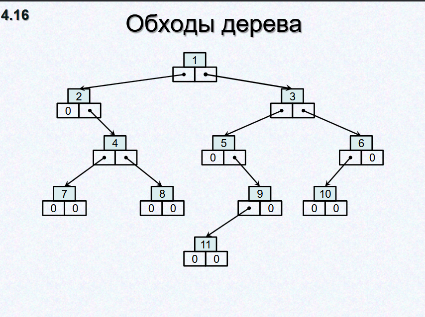

Прямой (Preorder)
	
    Корень → Левое → Правое
	
    1, 2, 4, 7, 8, 3, 5, 9, 11, 6, 10

Центрированный (Inorder)
	
    Левое → Корень → Правое
	
    2, 7, 4, 8, 1, 5, 11, 9, 3, 10, 6

Концевой (Postorder)
	
    Левое → Правое → Корень
	
    7, 8, 4, 2, 11, 9, 5, 10, 6, 3, 1

Оценка эффективности: Θ(n) для любого обхода (каждая вершина посещается 1 раз).

## Билет 19. Бинарные деревья поиска: определение, обход дерева, операции поиска. Поиск по ключу, минимума и максимума. Оценки эффективности.

BST – дерево, где для любой вершины x с ключом k_x:

    Все ключи в левом поддеревье Л[x] ≤ k_x
    Все ключи в правом поддеревье П[x] ≥ k_x
    Каждая вершина помечена отдельным ключом. 

Обход и поиск

    Центрированный обход BST выдаёт ключи в строго возрастающем порядке. 

    Поиск по ключу: сравниваем с текущим узлом. Если < → влево, если > → вправо, если == → успех. Дошли до NULL → отказ. 

    Поиск минимума: двигаться по указателям left до NULL. 

    Поиск максимума: двигаться по указателям right до NULL. 

Оценка эффективности

Все операции поиска выполняются за Θ(h), где h – высота дерева.

    Худший случай: дерево вырождено в список → h = n → Θ(n).

    Средний/оптимальный случай: сбалансировано → h ≈ log₂n → Θ(log n). 

## Билет 20. Бинарные деревья поиска: поиск предшествующего и последующего элементов. Оценки эффективности.

Определения

    Предшествующий (predecessor): элемент с наибольшим ключом < данного.

    Последующий (successor): элемент с наименьшим ключом > данного.

    Соответствуют соседям в последовательности центрированного обхода. 

Алгоритм поиска последующего (требует поле parent)

    Если есть правое поддерево: последующий = минимум правого поддерева (спуск влево до конца).

    Если правого поддерева нет: поднимаемся вверх по родителям, пока текущий узел не станет левым ребёнком своего родителя. Родитель этого узла и будет последующим.

    Если дошли до корня и не нашли → последующего нет (NULL). 

(Поиск предшествующего симметричен: если есть левое → максимум левого, иначе подъём вверх, пока узел не станет правым ребёнком.)

Оценка эффективности

В худшем случае Θ(n), в сбалансированном Θ(log n).

## Билет 21. Бинарные деревья поиска: вставка нового элемента. Оценки эффективности.

Алгоритм вставки

    Если дерево пусто (root == NULL) → новый элемент становится корнем.

    Иначе ищем позицию вставки, двигаясь от корня (как при поиске):

        Запоминаем текущего (cur) и его родителя (par).
        Если key_new < cur->key, тогда cur = cur->left, иначе cur = cur->right.

    Когда cur == NULL, присоединяем новый узел к par как левое или правое поддерево.

    Важно: Вставка всегда добавляет элемент как лист. 

 Оценка эффективности

    Поиск позиции: Θ(h)
    Присоединение: O(1)
    Итог: Θ(h). Может деградировать до Θ(n) при неудачной последовательности вставок. Для гарантии Θ(log n) нужны сбалансированные деревья.

## Билет 22. Бинарные деревья поиска: удаление элемента. Оценки эффективности.

Алгоритм удаления (унифицированный через Node** cur)

    Найти реально удаляемый узел y:

        Если у x ≤ 1 ребёнка → y = x.

        Иначе y = последующий элемент для x 
    (минимум правого поддерева). 
    У y гарантированно ≤ 1 ребёнок.

    Найти поддерево p узла y и родителя par.

    Перенастроить связи:
        Если p != NULL → p->parent = par
        Если par == NULL → root = p (удалялся корень)
        Иначе → par->left/right = p

    Копирование данных: Если y ≠ x, скопировать key и info из y в x.
    Освободить память y. 

Оценка эффективности

    Поиск y и par: Θ(h)
    Перенастройка + копирование: O(1)
    Итог: Θ(h).

## Билет 23. Красно-черные деревья: определение, представление в памяти. Повороты. Оценка эффективности.

Определение красно-черного дерева и его свойства

Красно-черное (RB — Red-Black) дерево — это двоичное (бинарное) дерево поиска, у которого каждому узлу сопоставляется дополнительная информация — цвет (красный или черный).

Дерево называется красно-черным, если оно удовлетворяет следующим 5 свойствам:

    Каждый узел является либо красным (RED), либо черным (BLACK).

    Корень дерева является черным.

    Все внешние листья (ограничители) являются черными.

    Если узел красный, то оба его потомка черные (красные узлы не могут идти подряд).

    Все пути, ведущие от любого узла к его листьям-потомкам, содержат одинаковое количество черных узлов.

2. Представление в памяти и структура узла

В отличие от стандартного бинарного дерева поиска, узел КЧ-дерева обязательно содержит указатель на родительский узел (parent) для обеспечения возможности движения «вверх» при балансировке, а также поле цвета.

На языке C структура узла выглядит следующим образом:
C
```
typedef struct Node {
    int color;           // 0 - RED, 1 - BLACK
    int key;             // Ключ узла
    struct Node *left;   // Указатель на левого потомка
    struct Node *right;  // Указатель на правого потомка
    struct Node *parent; // Указатель на родительский узел
} Node;
```

Использование ограничителя (EList)


    Все концевые указатели left и right внутренних узлов ссылаются на один и тот же адрес объекта EList.

    Цвет EList всегда ЧЕРНЫЙ. Поля key и parent для него не используются.

    Это позволяет избавиться от постоянных проверок на NULL в алгоритмах.

3. Повороты (Rotations)

Повороты — это локальные операции над указателями дерева, которые изменяют его структуру (высоту поддеревьев), но строго сохраняют свойства бинарного дерева поиска (порядок следования ключей: слева — меньшие, справа — большие).

    Левый поворот (Left_Rotate(X)):
    Применяется к узлу X, у которого правый поток Y не является EList. Узел X опускается налево, становясь левым потомком Y. Левое поддерево узла Y (если оно было) становится правым поддеревом узла X. Указатели родителей перестраиваются.

    Правый поворот (Right_Rotate(Y)):
    Симметричная операция. Применяется к узлу Y, у которого левый потомок X не является EList. Узел Y опускается направо, становясь правым потомком X. Правое поддерево узла X становится левым поддеревом узла Y.

4. Оценка эффективности

    Черная высота узла bh(x) — это количество черных узлов на пути от x (не включая сам узел x) до любого листа EList.

    Высота дерева (h): Высота КЧ-дерева с n внутренними узлами удовлетворяет строгому неравенству:
    ```
    h≤2⋅log2​(n+1)
    ```

    Сложность операций: Так как высота гарантированно логарифмическая, операции поиска (Search), нахождения минимума/максимума, а также вставки (Insert) и удаления (Delete) выполняются за время O(logn) в худшем случае. Время выполнения самих поворотов составляет O(1).

## Билет 24. Красно-черные деревья: общий алгоритм вставки нового элемента. Нарушение свойств красно-черного дерева при вставке.

Общий алгоритм вставки (Insert)

Алгоритм добавления нового ключа в КЧ-дерево состоит из:

    Поиск места для вставки: Дерево обходится сверху вниз от корня, как в обычном дереве поиска, пока не будет найден лист EList, на место которого должен встать новый элемент.

    Создание и инициализация узла:

        Вставляется новый динамический узел x с заданным ключом.

        Указатели left и right нового узла инициализируются ссылками на EList.

        Важное правило: узел x всегда изначально окрашивается в КРАСНЫЙ цвет (x->color = RED).

    Восстановление свойств КЧ-дерева: Вызывается корректирующая процедура RB_Insert_Fixup(x).

2. Нарушение свойств красно-черного дерева при вставке

Поскольку новый узел x всегда окрашивается в красный цвет, то:

    Свойство 5 (Равенство черной высоты) — гарантированно НЕ нарушается, так как новый узел добавляет 0 к числу черных узлов на путях.

    Свойства 1 и 3 — также не нарушаются (EList остается черным, цвета только RED/BLACK).

Какие свойства МОГУТ нарушиться:

    Свойство 2 (Корень черный): Если дерево было абсолютно пустым (состояло только из EList), то новый узел x станет корнем дерева. Поскольку он красный, свойство 2 нарушится. (Исправляется тривиально: в конце алгоритма корень принудительно перекрашивается в черный цвет).

    Свойство 4 (Красный узел имеет черных потомков): Это основное и критическое нарушение. Оно возникает в случае, если родитель нового узла (p1) тоже является КРАСНЫМ. В дереве появляются два красных узла подряд (родитель и сын), что недопустимо. Именно это нарушение устраняет процедура балансировки.


## Билет 25. Красно-черное дерево: восстановление свойств дерева при вставке нового элемента.

Процедура балансировки RB_Insert_Fixup(x) работает в цикле, пока текущий узел x не станет корнем или пока его родитель p1 не станет черным.

Мужская семья - ееее

Рассматривается ситуация, когда родитель p1 является левым потомком дедушки pp (ситуация, когда он является правым потомком, полностью зеркальна). Ключевую роль в определении сценария играет цвет дяди — узла p2 (второго сына дедушки pp).
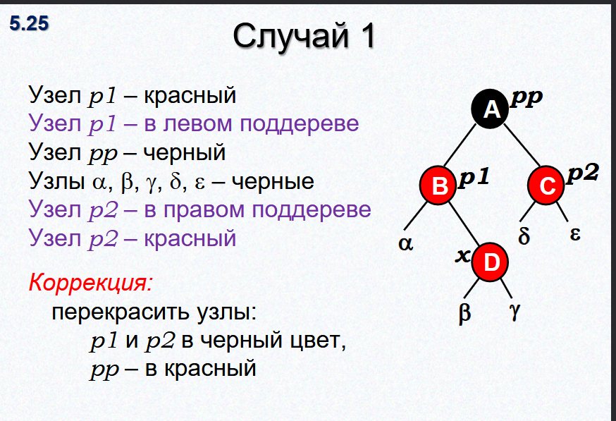
Случай 1: Дядя p2 — красный

    Условие: Узел x красный, родитель p1 красный, дядя p2 красный.

    Суть восстановления: Чернота спускается от дедушки вниз.

    Действия:

        Родитель p1 перекрашивается в ЧЕРНЫЙ.

        Дядя p2 перекрашивается в ЧЕРНЫЙ.

        Дедушка pp перекрашивается в КРАСНЫЙ.

        Текущий указатель x переносится на дедушку (x=pp). Цикл продолжается со следующего уровня вверх.

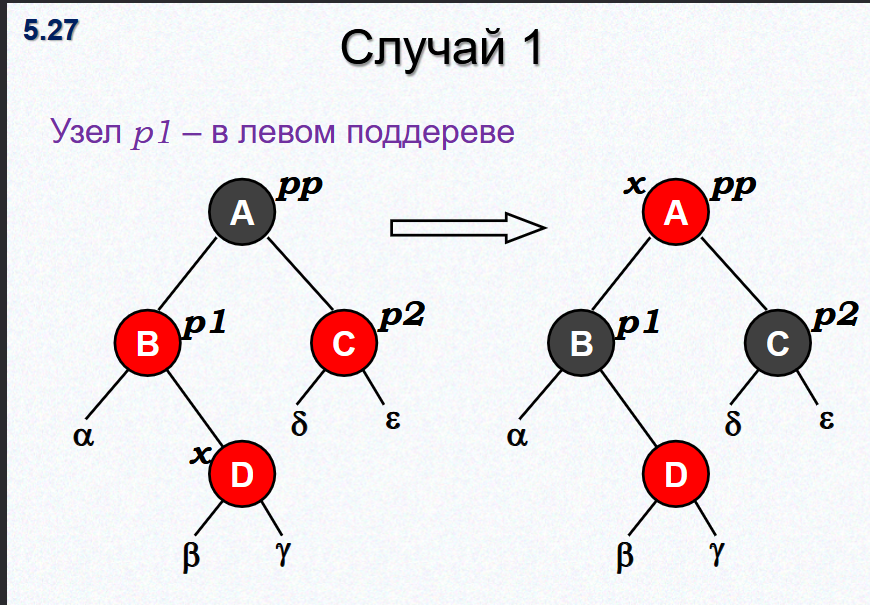

Случай 2: Дядя p2 — ЧЕРНЫЙ, а узел x является правым потомком своего родителя 

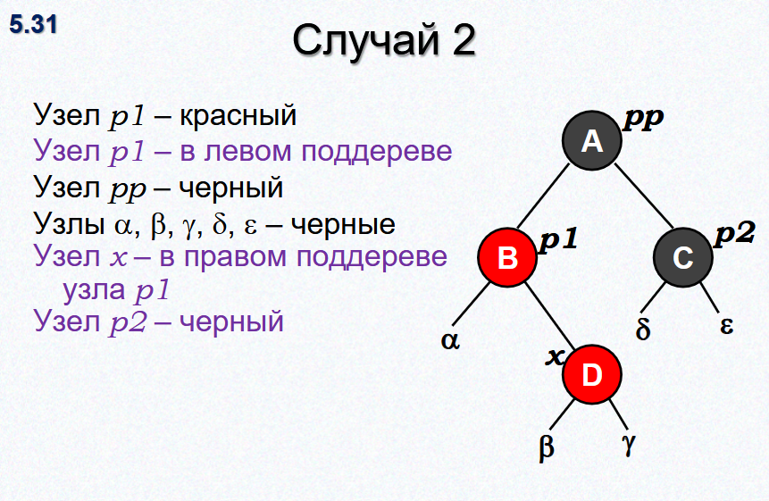
    Условие: p1 — красный (левый потомок pp), p2 — черный, а x — правый потомок p1.

    Суть восстановления: Сведение к линейной структуре (Случаю 3) с помощью малого поворота.

    Действия:

        Указатель x сдвигается на своего родителя (x=p1).

        Выполняется левый поворот вокруг нового узла x (Left_Rotate(x)).

        Дерево переходит в Случай 3.

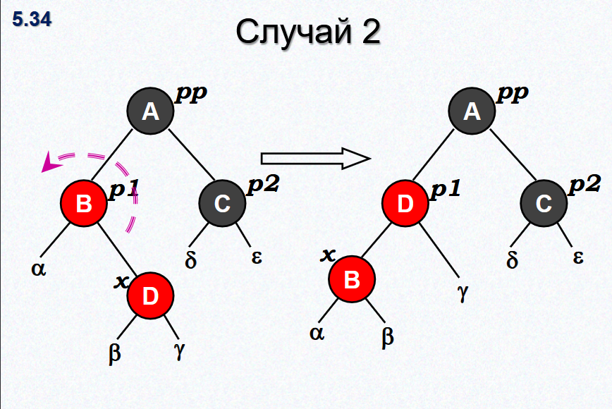

Случай 3: Дядя p2 — ЧЕРНЫЙ, а узел x является левым потомком своего родителя  

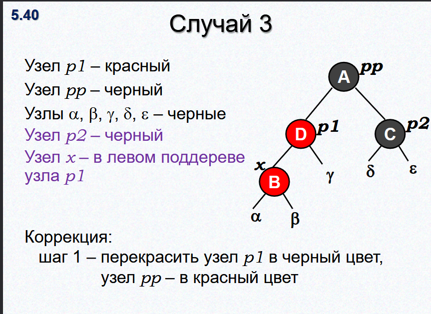

    Условие: p1 — красный, p2 — черный, x — левый потомок p1.

    Суть восстановления: Окончательное устранение нарушения за счет смены цветов и большого поворота, уводящего одну из красных вершин в соседнее поддерево.

    Действия:

        Родитель p1 перекрашивается в ЧЕРНЫЙ.

        Дедушка pp перекрашивается в КРАСНЫЙ.

        Выполняется правый поворот вокруг дедушки pp (Right_Rotate(pp)).

        На этом балансировка завершается (условие цикла нарушается, так как родитель узла x стал черным).

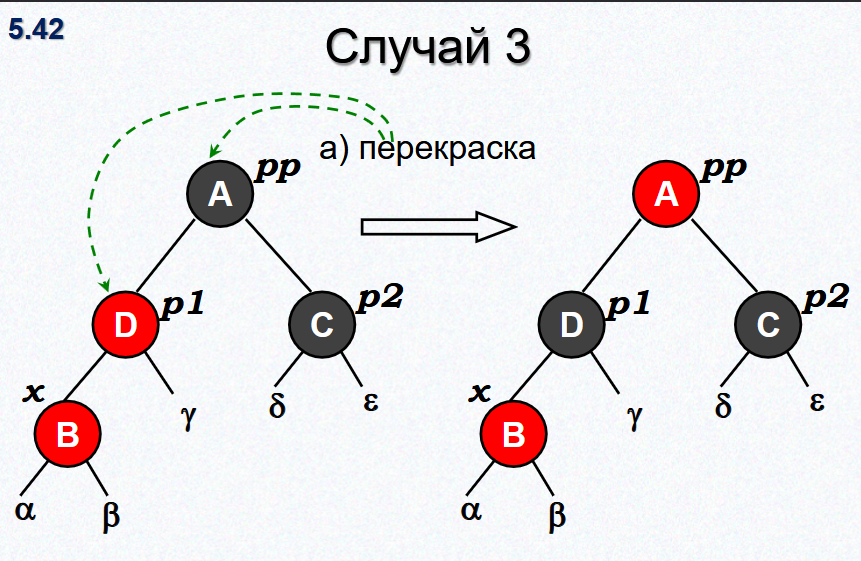
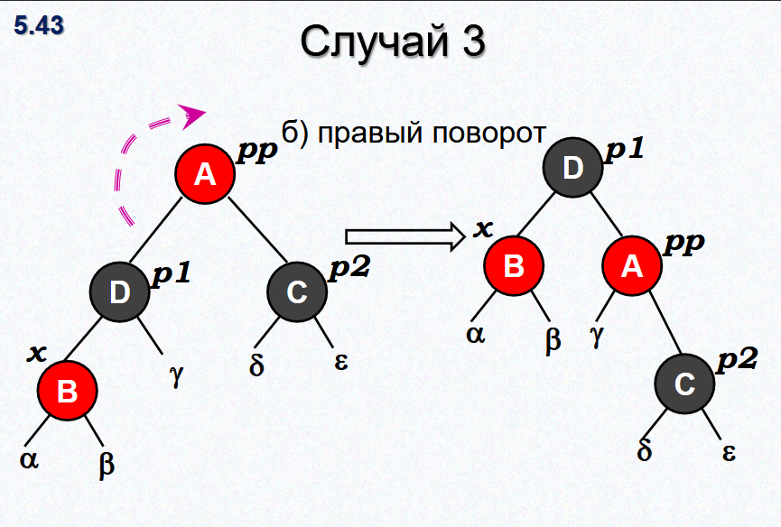

Финалочка алгоритма: root->color = BLACK (принудительное окрашивание корня).

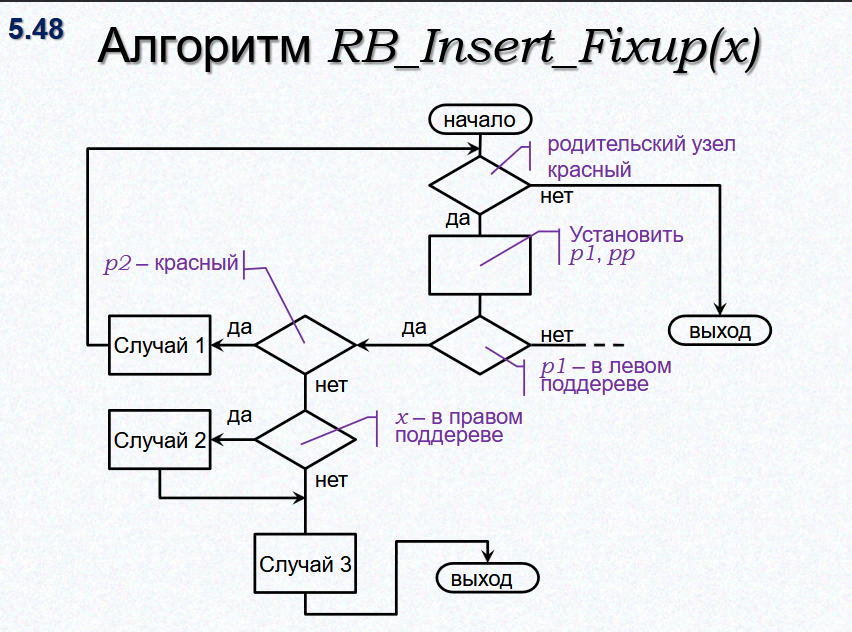

## Билет 26. Красно-черное дерево: общий алгоритм удаления элемента. Нарушение свойств красно-черного дерева при удалении.

Общий алгоритм удаления (RB_Delete)

Удаление узла основано на стандартной процедуре бинарного дерева поиска:

    Находится узел z, который требуется удалить.

    Определяется узел y, который будет фактически извлечен из памяти:

        Если у z менее двух внутренних детей (ноль или один), то удаляется сам z (y=z).

        Если у z два внутренних ребенка, то ищется узел y, следующий за ним по порядку (самый левый узел в правом поддереве z). Значение ключа из y копируется в узел z, а сам узел y подлежит физическому удалению.

    Таким образом, узел y гарантированно имеет не более одного внутреннего потомка. Обозначим этого единственного потомка (или EList, если детей нет) как x.

    Узел y вырезается из дерева, а узел x встает на его место (его родитель теперь указывает на родителя y).

    Анализ цвета удаленного узла y:

        Если y был КРАСНЫМ, балансировка не требуется (удаление красного узла не меняет черную высоту путей и не может создать две красные вершины подряд).

        Если y был ЧЕРНЫМ, свойства дерева нарушаются, и вызывается процедура RB_Delete_Fixup(x).

2. Нарушение свойств красно-черного дерева при удалении

Когда из дерева удаляется черный узел y, на всех путях, проходивших через этот узел, исчезает один черный узел.

Возникающие нарушения:

    Нарушение свойства 5 (Черная высота): Пути, проходящие через место удаленного узла, теперь содержат на одну черную вершину меньше, чем все остальные пути в дереве.

    Нарушение свойства 4: Если родитель узла y был красным, а вставший на его место узел x тоже красный, возникает недопустимая пара красных узлов подряд.

    Нарушение свойства 2: Если удаленный черный узел был корнем дерева, а на его место встал красный узел x.

Концепция решения: Чтобы сбалансировать черную высоту, узел x (занявший место удаленного черного узла) условно наделяется «дополнительным черным цветом».

    Если x изначально был красным, он становится черно-красным. Мы можем просто покрасить его в обычный ЧЕРНЫЙ цвет, добавив недостающую единицу черной высоты, и на этом закончить.

    Если x изначально черный, он становится «двукратно черным» (DOUBLE BLACK). Цель балансировки — «протолкнуть» эту лишнюю черноту вверх по дереву до корня или растворить ее с помощью перекрасок и поворотов.

## Билет 27. Красно-черное дерево: восстановление свойств дерева при удалении элемента.

Процедура RB_Delete_Fixup(x) выполняется в цикле, пока узел x не станет корнем дерева и пока его цвет остается строго ЧЕРНЫМ. На каждой итерации рассматривается «брат» текущего узла — узел w (второй потомок родителя p).

(Ниже описаны случаи, когда узел x является левым потомком своего родителя).

Случай 1: Брат w — КРАСНЫЙ

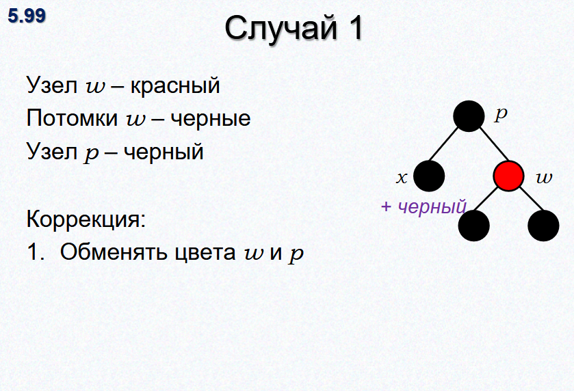

    Условие: w−>color==RED. Из свойств КЧ-дерева следует, что родитель p и дети узла w в этот момент обязаны быть черными.

    Суть восстановления: Трансформация дерева с целью сделать брата черным для применения последующих случаев.

    Действия:

        Брат w перекрашивается в ЧЕРНЫЙ.

        Родитель p перекрашивается в КРАСНЫЙ.

        Выполняется левый поворот вокруг родителя p (Left_Rotate(p)).

        Указатель на брата обновляется: w=p−>right. Дерево переходит к анализу Случаев 2, 3 или 4.

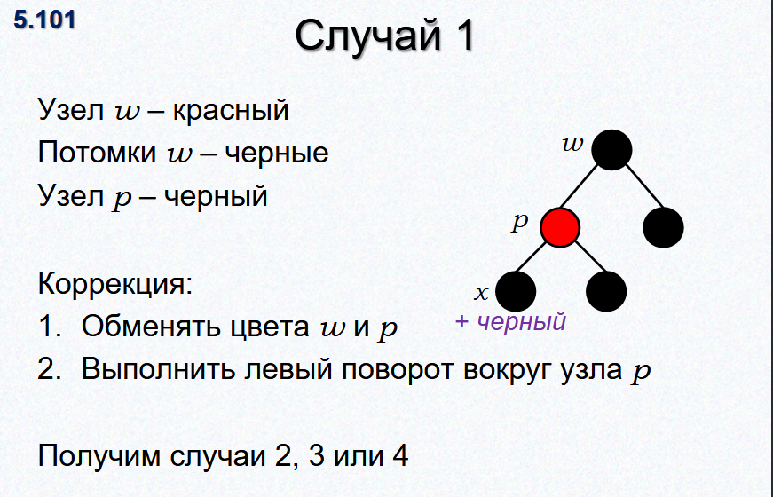

Случай 2: Брат w — ЧЕРНЫЙ, и ОБА его потомка — ЧЕРНЫЕ

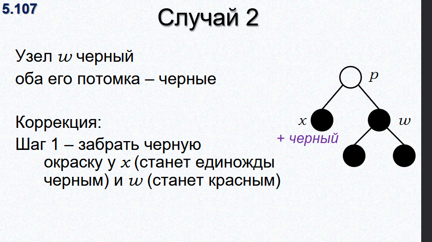

    Условие: w−>color==BLACK, а также w−>left−>color==BLACK и w−>right−>color==BLACK.

    Суть восстановления: Снятие одного уровня «черноты» с узла x и его брата w и перенос её на родителя.

    Действия:

        Брат w перекрашивается в КРАСНЫЙ (теперь пути через w тоже потеряли одну черную вершину, поддеревья родителя уравновешены).

        Указатель x переносится на родителя (x=p). На следующей итерации лишняя чернота анализируется уже на уровне родителя.

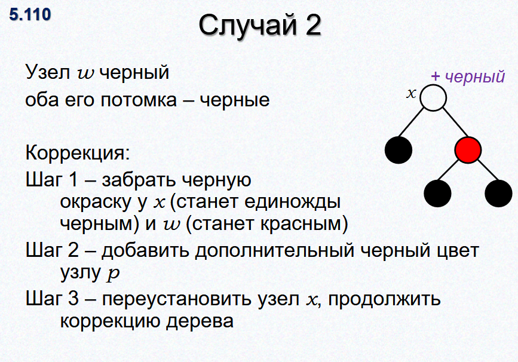

Случай 3: Брат w — ЧЕРНЫЙ, его ЛЕВЫЙ потомок — КРАСНЫЙ, ПРАВЫЙ — ЧЕРНЫЙ

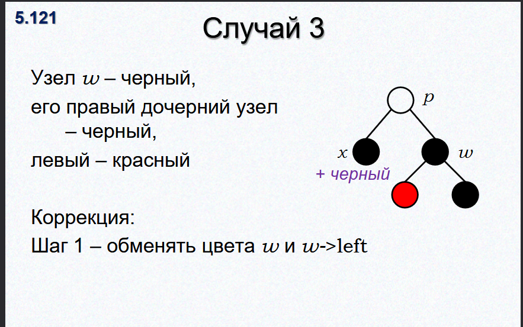

    Условие: w−>color==BLACK, левый сын — RED, правый сын — BLACK.

    Суть восстановления: Преобразование структуры к Случаю 4 с помощью смены цветов и поворота брата.

    Действия:

        Брат w перекрашивается в КРАСНЫЙ.

        Левый потомок брата w−>left перекрашивается в ЧЕРНЫЙ.

        Выполняется правый поворот вокруг брата w (Right_Rotate(w)).

        Указатель на брата обновляется: w=p−>right. Структура перешла в Случай 4.

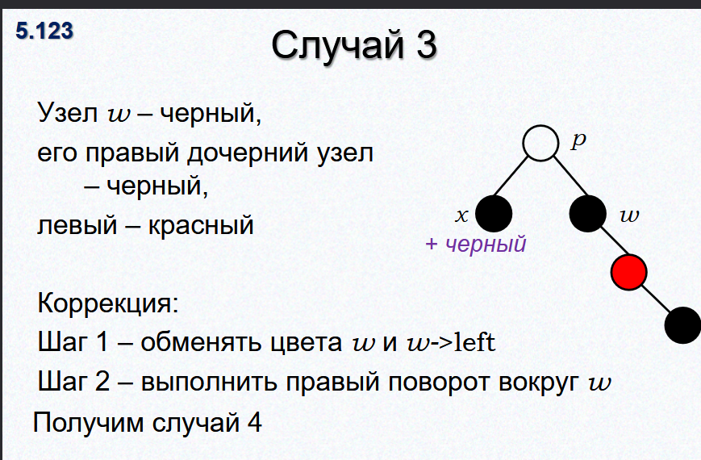

Случай 4: Брат w — ЧЕРНЫЙ, его ПРАВЫЙ потомок — КРАСНЫЙ

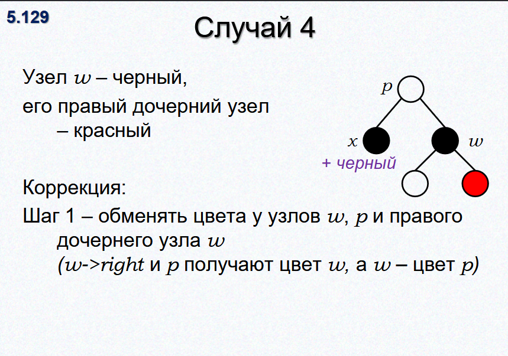

    Условие: w−>color==BLACK, правый сын — RED (цвет левого сына значения не имеет).

    Суть восстановления: Финальное и полное устранение двукратной черноты за счет распределения цветов и поворота вокруг родителя.

    Действия:

        Брат w принимает текущий цвет родителя p (w->color = p->color).

        Родитель p перекрашивается в ЧЕРНЫЙ.

        Правый потомок брата w->right перекрашивается в ЧЕРНЫЙ.

        Выполняется левый поворот вокруг родителя p (Left_Rotate(p)).

        Указатель x переносится на корень дерева (x = root), что гарантирует немедленный выход из цикла балансировки.

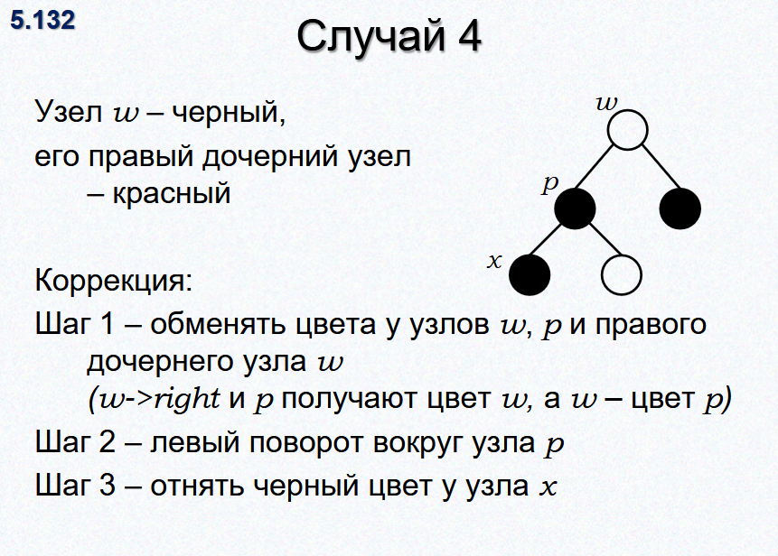

Выход из алгоритма: Текущий узел x (который теперь либо корень, либо стал просто черно-красным) принудительно окрашивается в ЧЕРНЫЙ цвет (x->color = BLACK). Баланс дерева полностью восстановлен

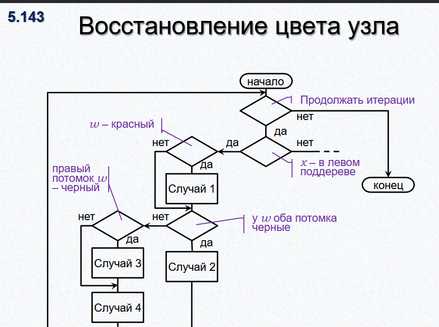

## Билет 28. AVL-дерево: определение, способы задания узлов AVL-дерева. Общий алгоритм вставки в AVL-дерево. Коррекция узлов.

1. Определение

AVL-дерево (Г.М. Адельсон-Вельский, Е.М. Ландис, 1962) – это сбалансированное бинарное дерево поиска, в котором для любого узла высоты левого и правого поддеревьев отличаются не более чем на 1. 

Высота дерева h ограничена: log₂(n+1) ≤ h ≤ 1,404·log₂(n+2) – 0,328.

2. Способы задания узлов

Предложены три варианта структуры узла:

    С полем балансировки (balance):
    balance = -1 → левое поддерево выше на 1; 0 → высоты равны; +1 → правое выше на 1.
    ```
    struct Node { int balance; int key; Node *left, *right, *parent; };
    ```
    С полями высот поддеревьев:
    ```
    struct Node { int hleft, hright; int key; Node *left, *right, *parent; };
    ```
    Хранит фактические высоты левого и правого поддеревьев.

    С полем высоты:
    ```
    struct Node { int height; int key; Node *left, *right, *parent; };
    ```
    Но его придётся каждый раз пересчитывать, не очень удобно

3. Общий алгоритм вставки

    Вставить новый ключ как в обычное бинарное дерево поиска (рекурсивно или итеративно до листа).

    После физической вставки начать подъём от нового узла к корню.

    На каждом шаге обновлять баланс/высоту родительского узла.

4. Коррекция узлов (проход вверх)

    Пока родитель p существует и p->balance == 0:

        Если вставка была в левое поддерево p → p->balance = -1, иначе +1.
        Перейти к следующему предку.

    Если встретился узел с p->balance ≠ 0:

        Если вставка компенсировала наклон (например, вставка в левое поддерево при balance == +1) → p->balance = 0, коррекция завершена.

        Если наклон усилился (balance стал +2 или -2) → требуется коррекция дерева (повороты, билет 29).

    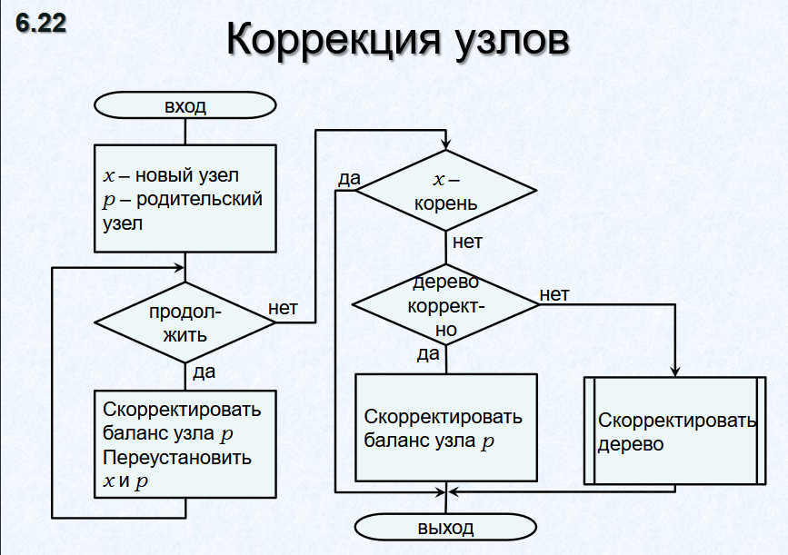

## Билет 29. Вставка нового элемента в AVL-дерево: коррекция AVL-дерева.

Коррекция выполняется, если баланс узла стал ±2. Различают два основных случая (по аналогии с классическим AVL):
    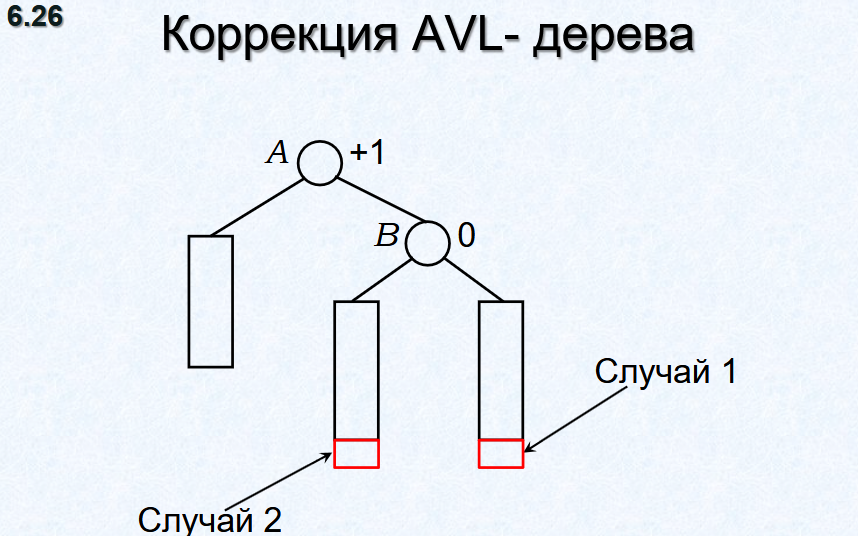
Случай 1: Одинарный поворот (Left-Left или Right-Right)

    Вставка произошла во внешнее поддерево разбалансированного узла.

    Решение: Один поворот (левый или правый) вокруг разбалансированного узла A.

    После поворота балансы узла A и его нового потомка B становятся 0. Высота поддерева не меняется, дальнейший подъём не требуется.

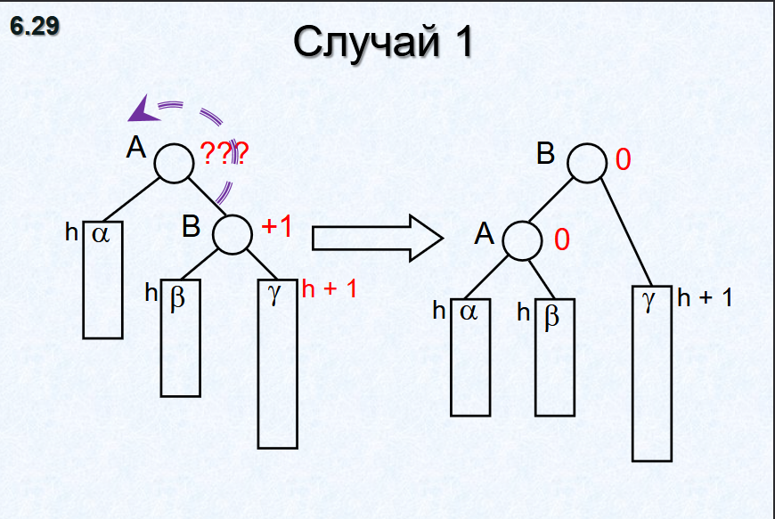

Случай 2: Двойной поворот (Left-Right или Right-Left)

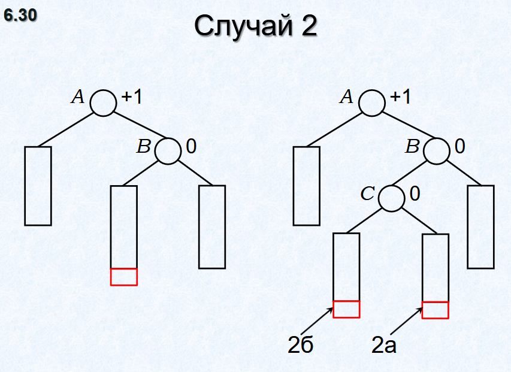

    Вставка произошла во внутреннее поддерево. Делится на подслучаи 2а и 2б в зависимости от баланса дочернего узла до вставки.

    Решение: 
        Повернуть дочерний узел B в сторону вставки.
        Повернуть узел A в противоположную сторону.

    Балансы обновляются по строгим правилам (становятся 0 или ±1 в зависимости от того, в какое именно подподдерево попал ключ). Высота корня скорректированного поддерева сохраняется, коррекция завершается.

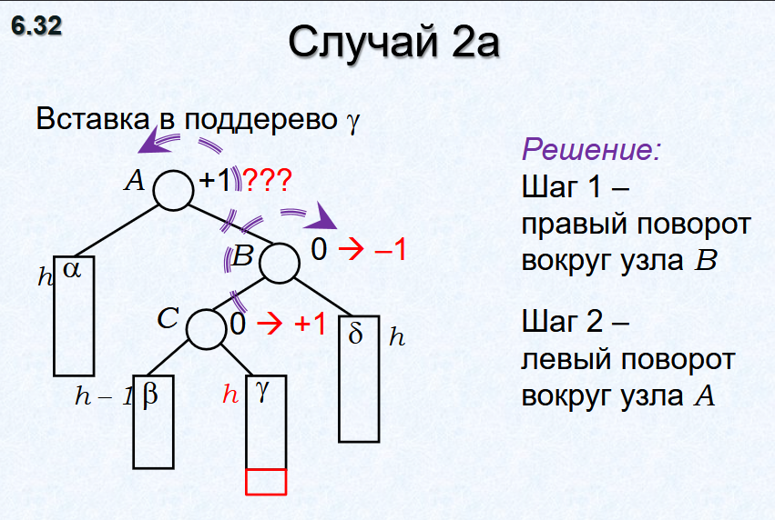
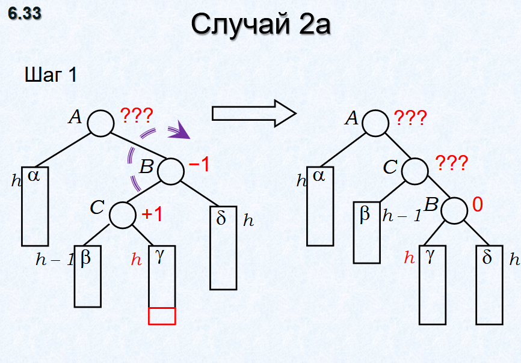
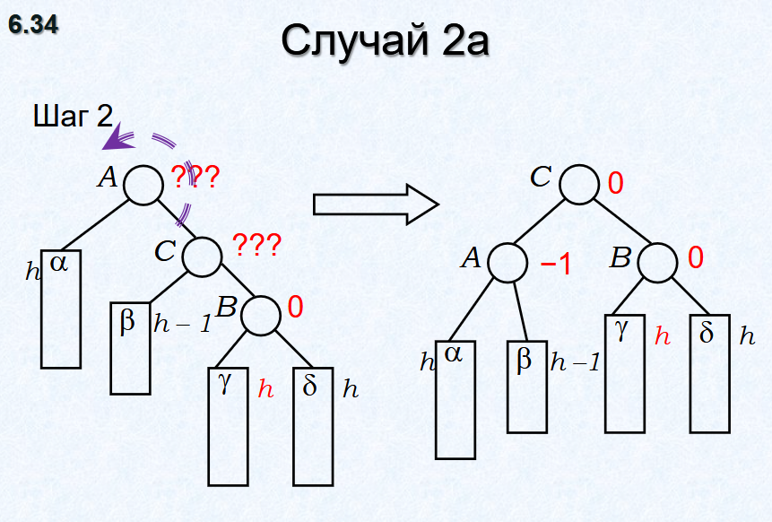
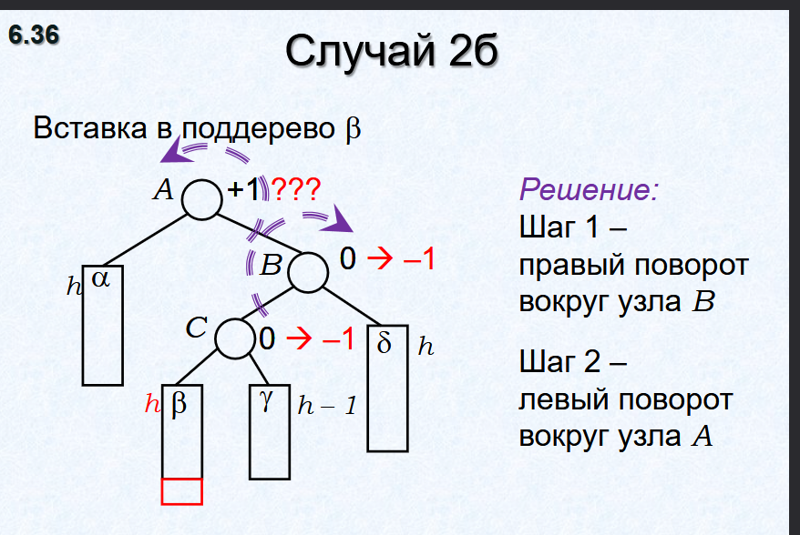
Дальше логика такая же


## Билет 30. Удаление элемента из AVL-дерева: общий алгоритм. Коррекция узлов AVL-дерева.

1. Общий алгоритм удаления

    Удаляется элемент так же, как в обычном бинарном дереве поиска.

    Если удаляемый узел имеет два ребёнка, он заменяется наименьшим ключом правого поддерева (или наибольшим левого), после чего фактическое удаление происходит в листе (или узле с одним ребёнком).

    Внешние листья обозначаются как EList (пустые указатели).

2. Коррекция узлов после удаления

    x – ребёнок удалённого узла (или лист, из которого удалили).

    Поднимаемся вверх по родителям p = x->parent.

    На каждом шаге уменьшаем высоту соответствующего поддерева p (p->hleft-- или p->hright--).

    Вычисляем dh = |p->hleft – p->hright|:

        dh > 1 → нарушение баланса, требуется коррекция дерева (билет 31). После неё алгоритм завершается (успех).
        dh == 1 → баланс восстановлен, но высота поддерева уменьшилась на 1. В данной реализации считается успех (коррекция локально завершена).
        dh == 0 → высота поддерева не изменилась, но баланс изменился. Продолжаем подъём: x = p; p = x->parent
    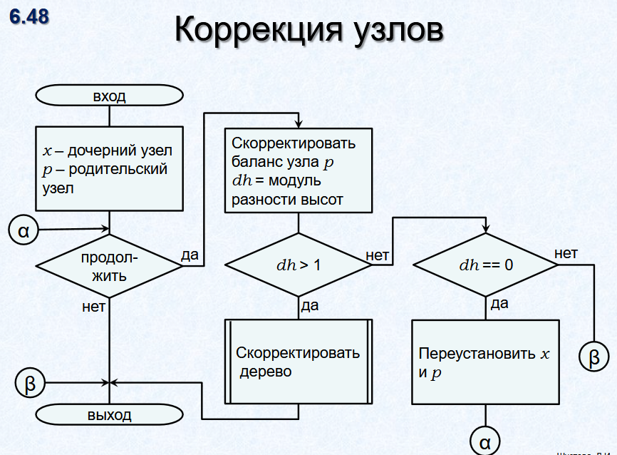

## Билет 31. Удаление элемента из AVL-дерева: коррекция дерева

При dh > 1 возникает разбалансировка узла A. Коррекция зависит от состояния соседнего поддерева (sibling B) и того, откуда была удалена высота.

Случай 1: Соседнее поддерево B имеет одинаковую высоту своих детей или внешнее поддерево выше.

    Решение: Одинарный поворот вокруг A. На картинке левый поворот
    Высота всего поддерева уменьшается на 1 → необходимо продолжить коррекцию выше по дереву.
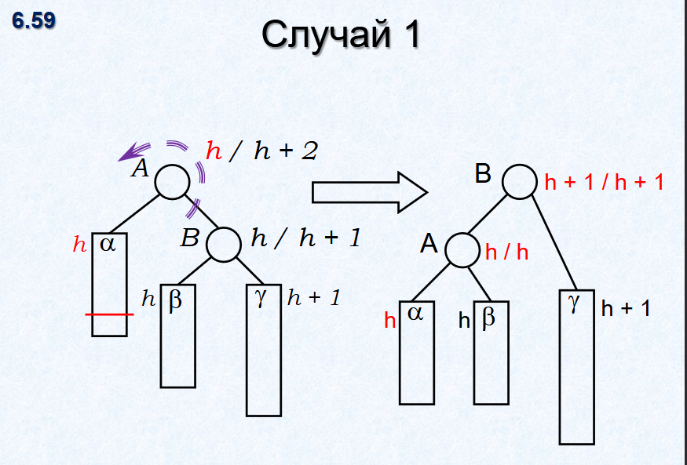

Случай 2а/2б: Соседнее поддерево B разбалансировано в сторону внутреннего поддерева.

    Решение: Двойной поворот (сначала вокруг B, затем вокруг A).
    Высота поддерева уменьшается на 1 → продолжаем коррекцию выше.

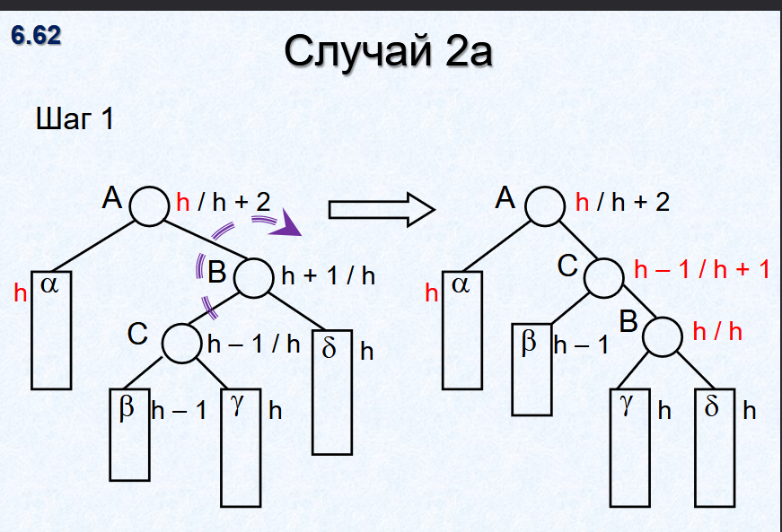
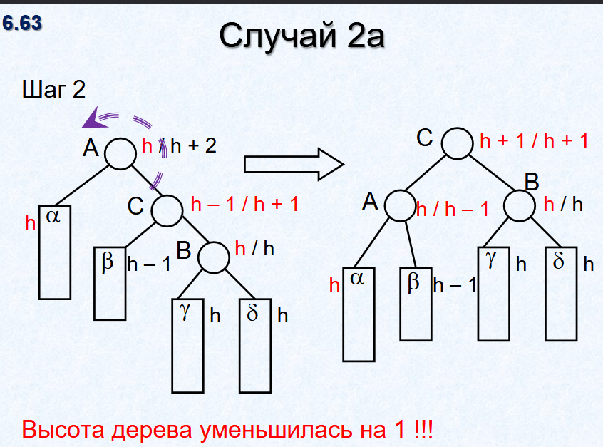
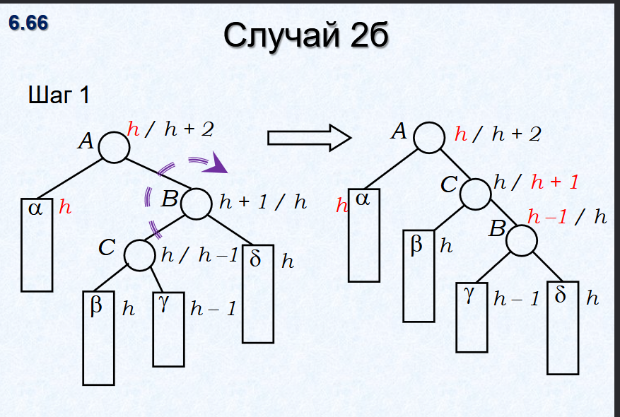
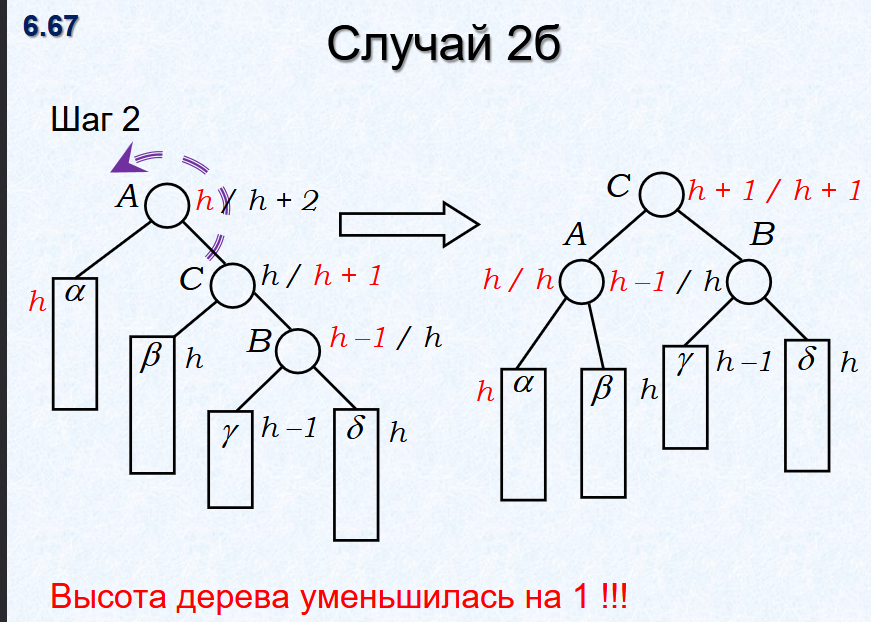
 Случай 3: Соседнее поддерево B сбалансировано или его внешнее поддерево выше, но после поворота высота сохраняется.

    Решение: Одинарный поворот вокруг A.
    Высота поддерева не меняется → коррекция завершается (успех), подъём прекращается.

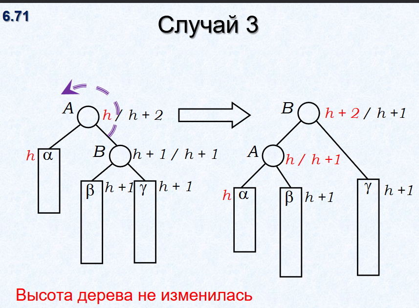

## Билет 32. B дерево: определение, структура узла. Поиск в B-дереве.

1. Определение

B-дерево степени t (t ≥ 2) – многопоисковое сбалансированное дерево, оптимизированное для внешней памяти.

    Каждый внутренний узел (кроме корня) имеет от t до 2t дочерних узлов.
    Содержит от t–1 до 2t–1 ключей. Узел полон, если ключей 2t–1.
    Корень имеет минимум 1 ключ и 2 потомка (если не является листом).
    Все листья находятся на одной глубине h.
    Ключи в узле упорядочены: k₁ ≤ k₂ ≤ … ≤ kₙ₋₁.

Варианты:
- 1970 г. Джон Хопкрофт (John E. Hopcroft)
– 2-3 деревья: каждый внутренний узел имеет
2 или 3 дочерних узла, все листья – на одном
уровне
- 2-3-4 деревья: каждый внутренний узел имеет
2, 3 или 4 дочерних узла
- 1972 г. Р. Байер (R. Bayer) и Э. Мак-Крэйт (E.M.
McCreight) – B деревья
2. Структура узла (C-подобная)
```
const int T = ...; // степень дерева
struct Node {
    int n;                // текущее количество ключей
    int key[2*T - 1];     // массив ключей
    Node* ptr[2*T];       // указатели на дочерние узлы (у листьев = NULL)
    Node* parent;         // указатель на родителя
};
```
3. Поиск

    Начинаем с корня x.

    В текущем узле ищем позицию i, такую что key[i-1] < k ≤ key[i].

    Если k == key[i] → успех (возвращаем указатель на узел и позицию).

    Если k < key[0] → спускаемся по ptr[0].

    Если k > key[n-1] → спускаемся по ptr[n].

    Иначе → спускаемся по ptr[i].

    Повторяем, пока не найдём ключ или не достигнем NULL (лист без ключа) → отказ.
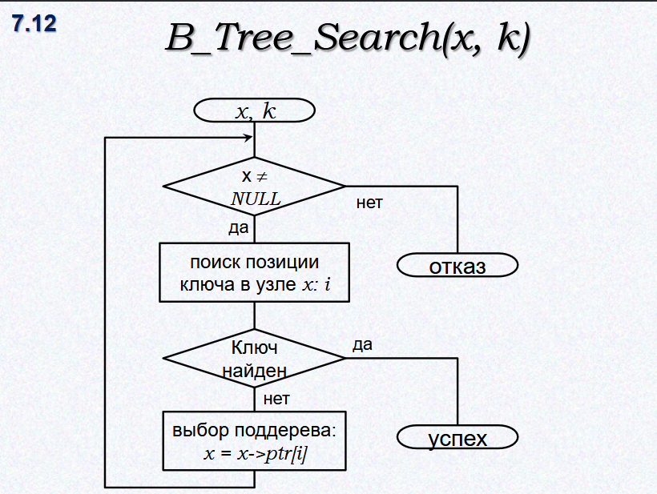
    Сложность: O(log_t n) обращений к узлам.

## Билет 33. Вставка нового элемента в B-дерево.

1. Общий принцип

    Новый элемент всегда вставляется в лист.

    Если лист заполнен (2t-1 ключей), происходит разбиение (split):

        Медианный ключ перемещается в родительский узел.
        Лист делится на два узла по t-1 ключей.
    Если родитель тоже заполнен, разбиение рекурсивно поднимается вверх.
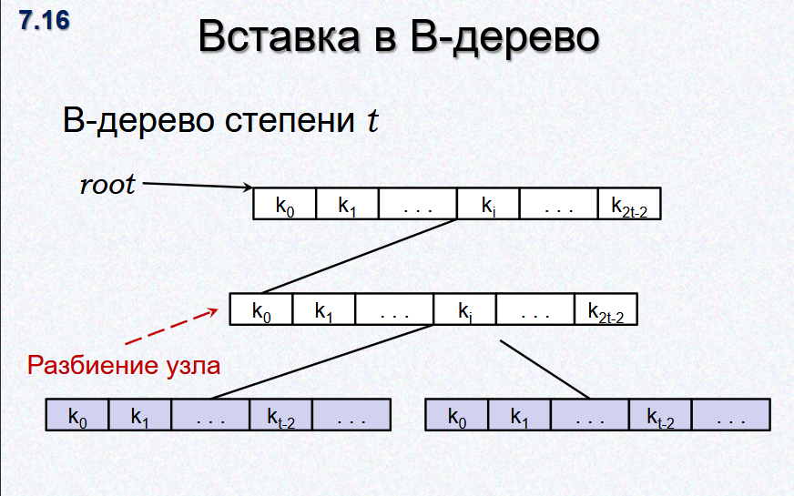
    Если переполняется корень, создаётся новый корень, высота дерева увеличивается на 1.

2. Алгоритм B_Tree_Insert(root, k)

    Если корень полон: создать новый узел s, сделать его корнем, старый корень прикрепить как s->ptr[0], вызвать B_Tree_Split(s, 0).

    Вызвать B_Insert_Nonfull(r, k):

        Пока x не лист:
            Найти позицию i для k.
            Если x->ptr[i] полон → B_Tree_Split(x, i).
            Выбрать нужный указатель (ptr[i] или ptr[i+1] в зависимости от k) и спуститься.

        Вставить k в лист x, сохраняя порядок ключей.

3. Разбиение узла B_Tree_Split(x, i)

    y = x->ptr[i] (полный узел, 2t-1 ключей).

    Сдвинуть в x ключи и указатели, начиная с i, вправо.

    Создать новый узел z.

    Переместить в z ключи и указатели из y, начиная с j = t.

    Медианный ключ y->key[t-1] поместить в x->key[i].

    Указать x->ptr[i+1] = z.

    Скорректировать счётчики ключей в x, y, z.
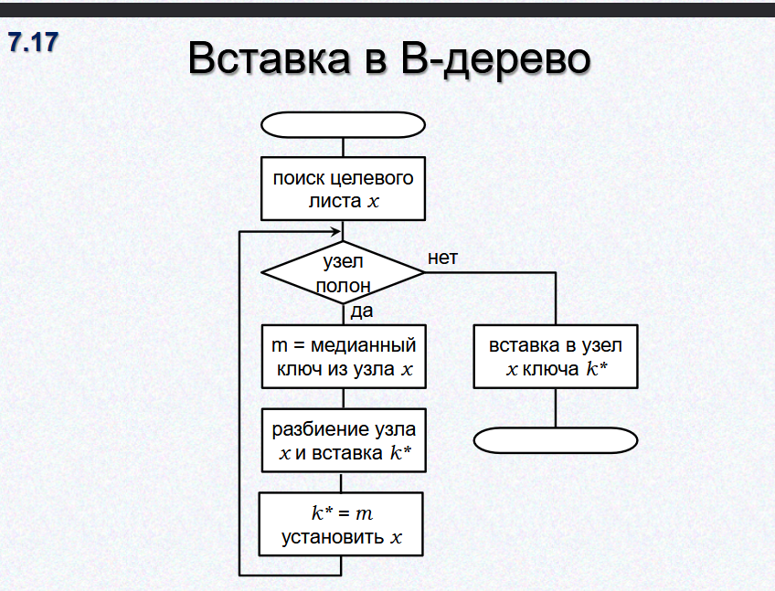
## Билет 34. Удаление элемента из B-дерева.

1. Общий алгоритм

    Если ключ в листе → просто удалить.

    Если ключ во внутреннем узле → заменить его ближайшим значением из поддерева (наименьшим ключом правого потомка или наибольшим левого), затем удалить этот ключ из листа.

    После удаления проверить лист на антипереполнение (< t-1 ключей). Если нарушено → коррекция.

2. Способы коррекции при антипереполнении

    Перераспределение (заимствование):
    Если соседний узел (левый или правый) имеет ≥ t ключей, берём у него один ключ через родительский разделитель. 
     Разделитель опускается в deficient-узел, ключ соседа поднимается в родитель. Указатели корректируются.

    Слияние:
        Если оба соседа имеют только t-1 ключей, объединяем deficient-узел с соседом и родительским разделителем в один узел (2t-1 ключей). Родитель теряет ключ и указатель. Если родитель сам оказался в антипереполнении, процесс повторяется вверх.

3. Обработка корня и особые ситуации

    Ситуация 1 (ключ не в текущем узле): Спускаемся в поддерево, которое должно содержать ключ. Если этот узел имеет t-1 ключей, пытаемся заимствовать у соседа или сливаем с соседом и разделителем родителя.

    Ситуация 2 (ключ в текущем узле): Заменяем на предшественника/преемника, спускаемся в соответствующее поддерево, применяем те же правила заимствования/слияния.

    Слияние корня: Если корень содержит 1 ключ, а оба его потомка имеют по t-1 ключу, все три узла сливаются в один. Новый узел становится корнем, высота дерева уменьшается на 1.

## Билет 35. Пирамида: определение, свойства пирамиды. Операция поддержки свойства пирамиды. Создание пирамиды.

1. Определение пирамиды (Binary Heap)

Пирамида — это объект-массив, представляющий почти полное бинарное дерево:

    Все уровни дерева, кроме последнего, заполнены полностью

    Последний уровень заполняется слева направо

    Узел дерева = элемент массива

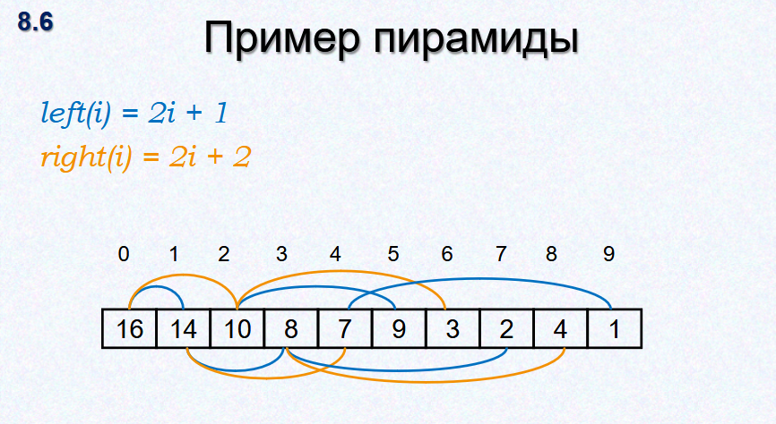
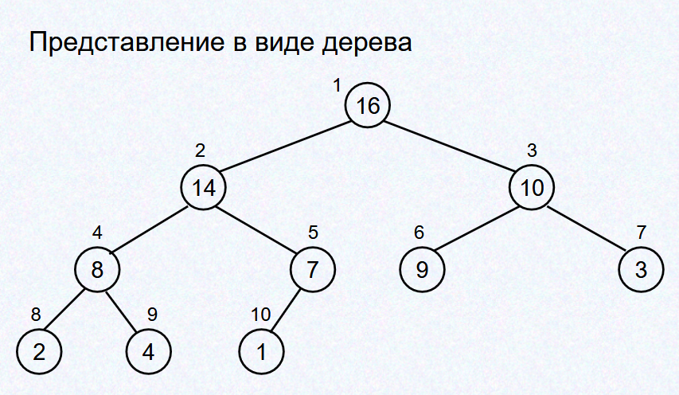

Max-heap (невозрастающая)

	Ключ родителя ≥ ключей потомков
	A[parent(i)] ≥ A[i]

Min-heap (неубывающая)
	
    Ключ родителя ≤ ключей потомков
    A[parent(i)] ≤ A[i]

Индексация (при нумерации с 1):

    parent(i) = i / 2
    left(i) = 2 * i
    right(i) = 2 * i + 1

Индексация (при нумерации с 0):

    parent(i) = (i - 1) / 2
    left(i) = 2 * i + 1
    right(i) = 2 * i + 2

Операция поддержки свойства: Max_Heapify(A, i)

Предусловие: поддеревья с корнями left(i) и right(i) уже являются max-heap, но элемент A[i] может нарушать свойство.

Смотрите код

Сложность: O(h), где h — высота узла i (в худшем случае O(log n))

4. Создание пирамиды: Build_Max_Heap(A)

Идея: листья (i = n/2 ... n-1) уже являются пирамидами (высота 0). Обрабатываем узлы снизу вверх.

Сложность: O(n) (амортизированная, не O(n log n), т.к. большинство узлов имеют малую высоту)


## Билет 36. Пирамидальная сортировка.

Только код (специально для Санечки 🦅🦅🦅🛸👽🏈🌎🌹🌹🌹🌹🌹)

```
typedef struct Heap{
    int *data;
    int size;
    int capacity;
}Heap;

Heap* create(int capacity){
    Heap *heap=(Heap*)malloc(sizeof(Heap));
    heap->data=(int*)malloc(sizeof(int)*capacity);
    heap->size=0;
    heap->capacity=capacity;
    return heap;
}

int max_heap(Heap* heap, int i){
    int largest=i;
    int left=2*i+1;
    int right=2*i+2;
    if (left<heap->size && heap->data[left]>heap->data[largest]) largest=left;
    if (right<heap->size && heap->data[right]>heap->data[largest]) largest=right;
    if (largest!=i){
        int time=heap->data[i];
        heap->data[i]=heap->data[largest];
        heap->data[largest]=time;
        max_heap(heap, largest);
    }
    return 0;
}

void build_max_heap(Heap* heap){
    for (int i=heap->size/2-1; i>=0; i--){
        max_heap(heap, i);
    }
}

int heap_sort(Heap *heap){
    build_smax_heap(heap);
    int i=heap->size;
    while (i>0){
        int time=heap->data[0];
        heap->data[0]=heap->data[i];
        heap->data[i]=time;
        heap->size--;
        max_heapify(heap,0);
    }
    return 0;
}

```


Время (лучший/средний/худший) -O(n log n)

Память - O(1) (сортировка на месте)

## Билет 37. Очереди с приоритетами: определение, основные операции.

1. Определение

Очередь с приоритетами — структура данных для обслуживания множества S, где каждый элемент имеет ключ (приоритет). Элементы извлекаются в порядке приоритета.

2. Основные операции (для max-очереди)

Maximum(S)
	
    Вернуть элемент с наибольшим ключом (не удаляя)
	O(1)

Extract_Max(S)
	
    Вернуть и удалить элемент с наибольшим ключом
	O(log n)

Insert(S, x)

	Вставить элемент x
	O(log n)

Increase_Key(S, i, k)

    Увеличить ключ элемента i до k (k ≥ current)

## Билет 38. Списки с пропусками: общее понятие, определения. Структура элемента списка. Операции поиска, вставки и удаления.

Skip List — вероятностная структура данных, альтернатива сбалансированным деревьям. Предложена William Pugh (1990)
.
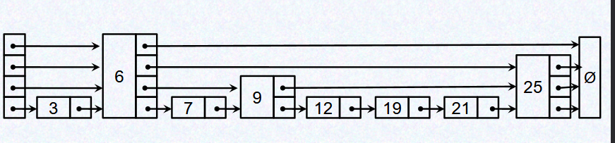
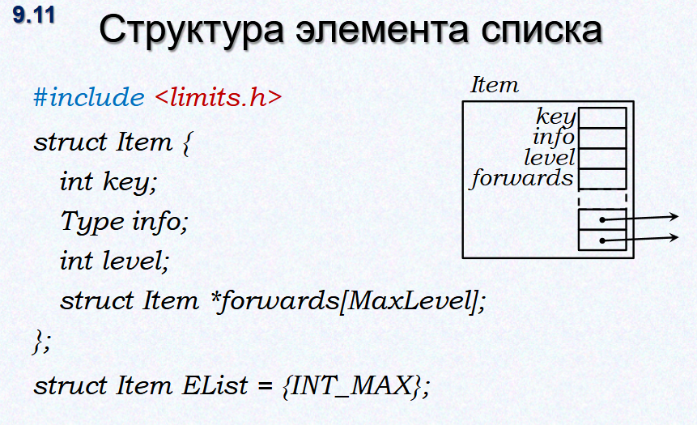
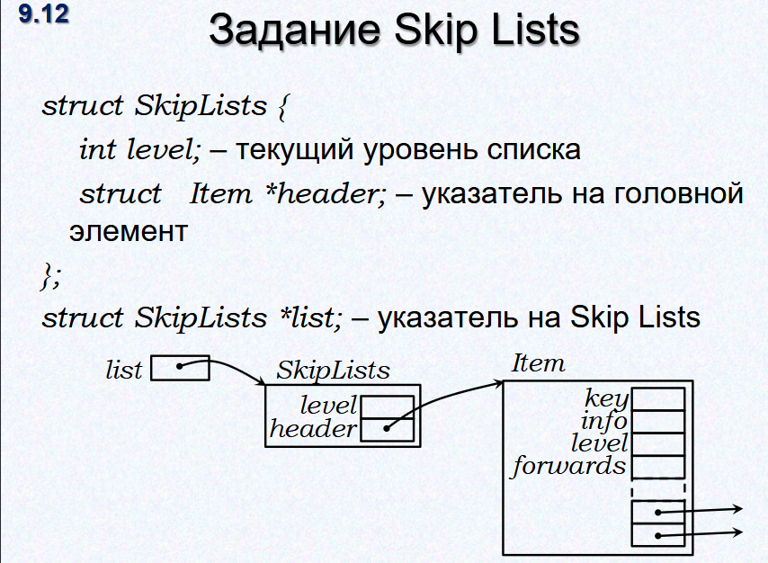

Идея: упорядоченный связный список + дополнительные «экспресс-уровни» для ускорения поиска.

    Элемент уровня k — имеет k указателей forward[]

    Уровень списка — максимальный уровень среди всех элементов

    Вероятность p — доля элементов уровня i, переходящих на уровень i+1 (обычно p = ½)

Ожидаемое распределение:

    50% элементов — уровень 1
    25% — уровень 2
    12.5% — уровень 3
    ...

Остальное код, но так как мне лень его писать и даже лень дипсикать, то ловите слайды из презентации))

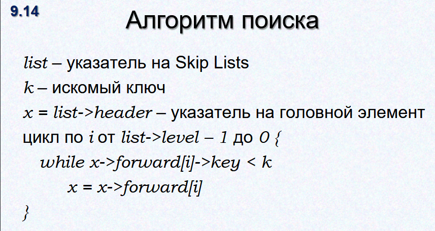
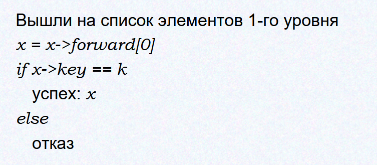
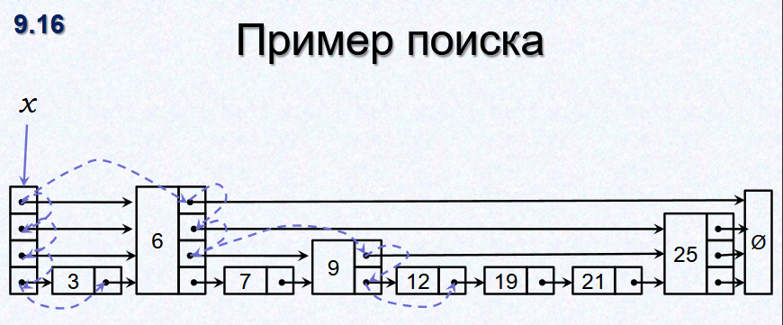

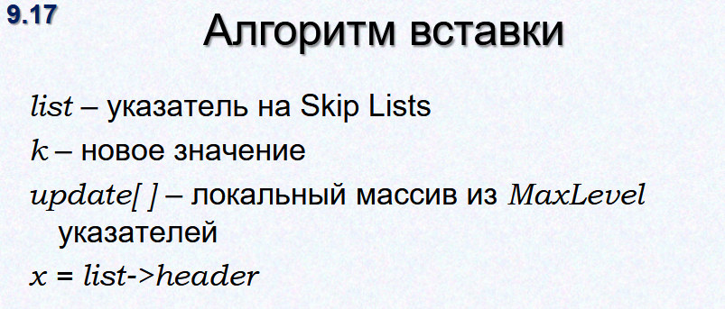
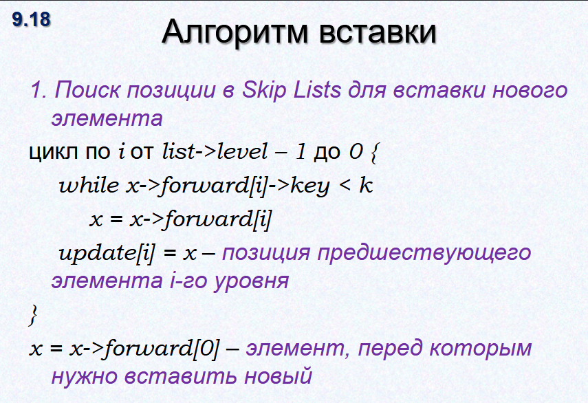
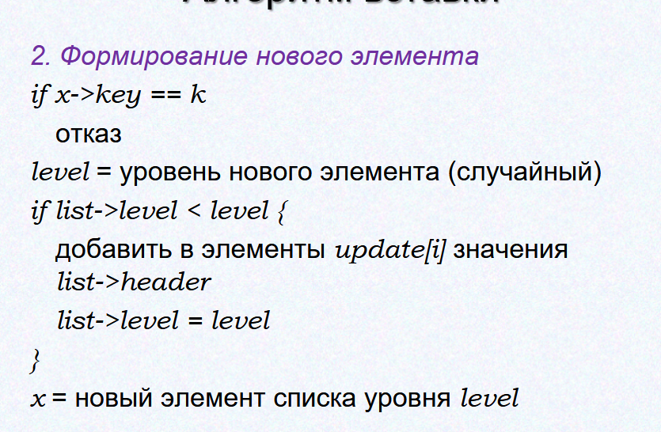
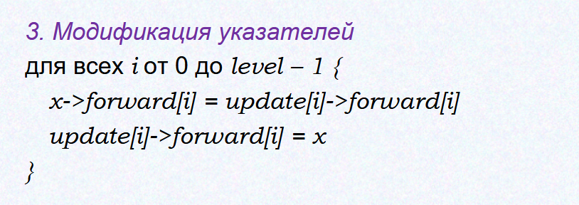
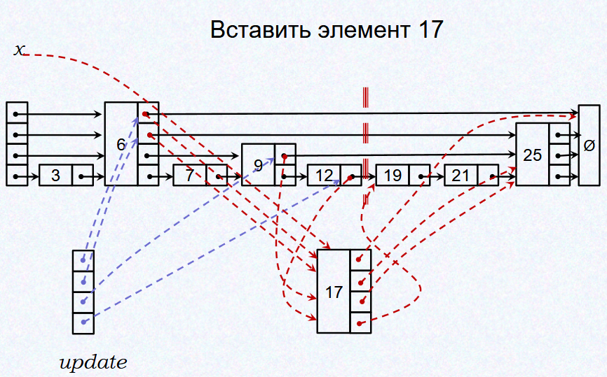

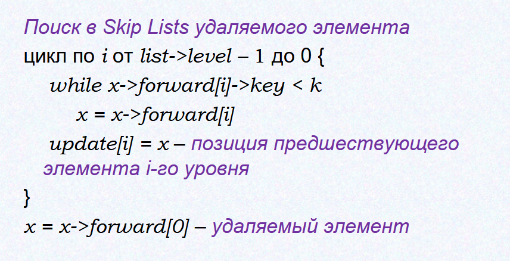
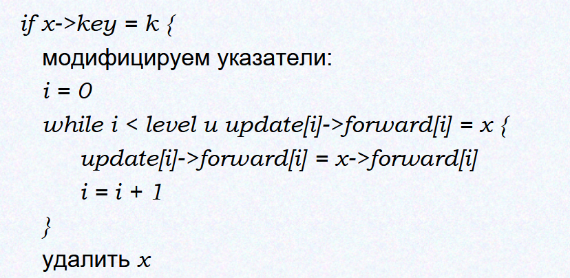
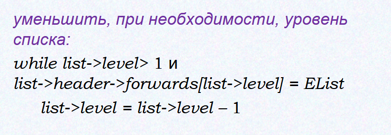
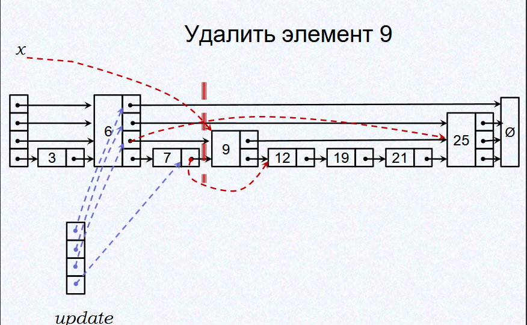

## Билет 39. Графы: определение, ориентированный и неориентированный графы, взвешенные графы. Понятие пути в графе, длина пути. Представление графа.

1. Определение

Граф G = (V, E):
    V — множество вершин (нод)
    E — множество рёбер (пар вершин)

2. Виды графов

Неориентированный

	Рёбра не имеют направления: (u,v) ≡ (v,u)
	

Ориентированный
	
    Рёбра — дуги: (u→v) ≠ (v→u)
	

Взвешенный
	
    Каждому ребру сопоставлен вес w(u,v)
	
Связный
	
    Между любыми двумя вершинами есть путь
	
Полный
	
    Каждая пара вершин соединена ребром
	
3. Основные понятия

    Путь — последовательность вершин v₁, v₂, ..., vₖ, где (vᵢ, vᵢ₊₁) ∈ E

    Длина пути — количество рёбер (или сумма весов во взвешенном графе)

    Цикл — путь, где v₁ = vₖ

    Степень вершины — количество инцидентных рёбер (для орграфа: полустепень захода/исхода)

4. Представление графа в памяти

Матрица смежности

    Плюсы: проверка ребра O(1), удобно для плотных графов
    Минусы: память O(V²), перебор соседей O(V)


Списки смежности

    Плюсы: память O(V+E), перебор соседей O(deg(v))
    Минусы: проверка ребра O(deg(v))


Список рёбер

    Подходит для алгоритмов Крускала, Форда-Беллмана


## Билет 40. Алгоритмы обхода графа: поиск в ширину, поиск в глубину.

Поиск в ширину (BFS — Breadth-First Search)

Идея: обходить вершины «слоями» — сначала все соседи текущей, затем их соседи и т.д. Использует очередь.

Применение: поиск кратчайшего пути в невзвешенном графе, проверка связности, волновой алгоритм.

Алгоритм:

    Инициализация: color[v]=белый, d[v]=∞, pred[v]=NULL для всех v.
    color[s]=серый, d[s]=0, поместить s в очередь Q.
    Пока Q не пуста:
        u = dequeue(Q)
        Для каждого соседа v ∈ Adj[u]:
            Если color[v] == белый: color[v]=серый, d[v]=d[u]+1, pred[v]=u, enqueue(Q)
        color[u]=черный

Сложность: O(V + E) (каждая вершина и ребро обрабатываются один раз)

2. Поиск в глубину (DFS — Depth-First Search)

Идея: идти «вглубь» по одному пути до тупика, затем возвращаться (backtracking). Использует стек (явно или рекурсию).

Применение: топологическая сортировка, поиск компонент связности, обнаружение циклов.

Алгоритм:

    Инициализация: color[v]=белый, pred[v]=NULL, time=0.
    Для каждой вершины u ∈ V: если color[u]==белый → DFS_Visit(u).
    DFS_Visit(u):
        color[u]=серый, time++, d[u]=time (время открытия)
        Для каждого v ∈ Adj[u]: если color[v]==белый → pred[v]=u, DFS_Visit(v)
        color[u]=черный, time++, f[u]=time (время завершения)

Сложность: O(V + E)

## Билет 41. Поиск кратчайшего пути в графе. Алгоритм Дейкстры.

Задача: Найти кратчайшие пути от одного истока s до всех вершин в графе с неотрицательными весами рёбер.

Ключевая операция – Ослабление (Relax): - да и вообще зачилльтесь)
```
f (d[v] > d[u] + w(u,v)) {
    d[v] = d[u] + w(u,v);
    pred[v] = u;
}
```
Алгоритм:

    Инициализация: d[v]=∞, pred[v]=NULL для всех v. d[s]=0. S=∅ (множество обработанных вершин). 
    Q=V (очередь с приоритетами по d).

    Пока Q не пуста:
        u = Extract_Min(Q) (вершина с минимальной оценкой)
        S = S ∪ {u}
        Для каждого соседа v ∈ Adj[u]: выполнить Relax(u, v)

Сложность:

    Массив/вектор для Q: O(|V|²)
    Бинарная куча: O(|E| log |V|)
    Куча Фибоначчи: O(|V| log |V| + |E|)

Проблемка: Не работает с отрицательными весами рёбер.

## Билет 42. Топологическая сортировка.

Определение: Линейное упорядочение вершин ориентированного ациклического графа (DAG), такое что для любого ребра (u, v) вершина u стоит в списке раньше v.

Алгоритм (на основе DFS):

    Вызвать DFS(G) для вычисления времени завершения f[v] каждой вершины.

    При завершении вершины (окрашивание в чёрный) вставлять её в начало связного списка.

    Вернуть список. Версии расположены в порядке убывания f[v].

Сложность: O(|V| + |E|) (время DFS + O(1) на вставку в начало списка).


## Билет 43. Задача о кратчайшем пути. Алгоритм Беллмана-Форда.

Задача: Найти кратчайшие пути от истока s в графе с возможными отрицательными весами. Обнаруживает циклы отрицательного веса, достижимые из s.

Алгоритм:

    Инициализация: d[s]=0, d[v]=∞, pred[v]=NULL.

    Цикл i от 1 до |V|-1:
        Для каждого ребра (u, v) ∈ E: Relax(u, v)

    Проверка на цикл отрицательного веса:
        Для каждого (u, v) ∈ E: если d[v] > d[u] + w(u,v) → отказ (цикл есть).
        Иначе → успех, расстояния найдены.

Сложность: O(|V|·|E|).

Особенности: Медленнее Дейкстры, но универсальнее. Если после |V|-1 итераций можно ещё улучшить расстояние, значит существует цикл отрицательного веса.

## Билет 44. Алгоритм Флойда-Варшалла.

Задача: Найти кратчайшие пути между всеми парами вершин. Допускает отрицательные веса, но не циклы отрицательного веса.

Идея (Динамическое программирование):
d[i][j][k] – вес кратчайшего пути из i в j, использующего только промежуточные вершины из множества {1..k}.

```
d[i][j][k] = min( d[i][j][k-1],  d[i][k][k-1] + d[k][j][k-1] )
```

Итеративная реализация :
```
for (k = 1 to |V|)
  for (i = 1 to |V|)
    for (j = 1 to |V|)
      d[i][j] = min(d[i][j], d[i][k] + d[k][j]);
```

Восстановление пути: матрица предшественников π[i][j], обновляется при сокращении пути.

Вообще можно всё построить по последней версии матрицы, бабка может это попросить сделать)

Сложность: Θ(|V|³) по времени, O(|V|²) по памяти.

## Билет 45. Поиск сильно связных компонентов.

Определение: Сильно связный компонент (SCC) – максимальное подмножество вершин C, где для любой пары u, v ∈ C существуют пути u → v и v → u.

Алгоритм (двойной DFS):

    Вызвать DFS(G), вычислить время завершения f[u] для каждой вершины.

    Построить транспонированный граф G^T (развернуть все рёбра).

    Вызвать DFS(G^T), но выбирать стартовые вершины в порядке убывания f[u] (от последней завершённой к первой).

    Каждое дерево, полученное на шаге 3, является одним сильно связным компонентом.

Сложность: O(|V| + |E|).

Идея: Вершина с максимальным f[u] принадлежит компоненту без исходящих рёбер в графе компонент. В G^T DFS «захватывает» весь компонент целиком.

## Билет 46. Минимальные остовные деревья. Построение минимального остовного дерева. Алгоритм Крускала.

Определение: Остовное дерево – ациклическое подмножество рёбер, соединяющее все вершины связного взвешенного графа. MST имеет минимальный суммарный вес.

Идея Крускала: Жадный алгоритм, работающий с лесом. 

Interesting fact:
Жадный (greedy) алгоритм - это алгоритм, который на каждом этапе принимает локально оптимальные решения, допуская, что итоговое решение окажется наиболее оптимальным. 
Алгоритм Дейкстры тоже является жадным, потому что при каждой итерации мы выбираем наименьший вес вершины, в надежде, что в итоге получим кратчайший путь. Вот такие пироги)
Но алгоритм Флойда-Варшалла не является жадным, хотя тоже ищет кратчайший маршрут, но только между всеми вершинами, этот алгоритм скорее относится к динамическому программированию. Ладно, отсутупление закончено)

Сортируем рёбра по весу. Последовательно добавляем легчайшее ребро, если оно соединяет два разных дерева (не создаёт цикл). Использует систему непересекающихся множеств (DSU).

Алгоритм:

    A = ∅. Для каждой v ∈ V: Make_Set(v).
    Отсортировать E по неубыванию веса.
    Для каждого (u, v) в отсортированном порядке:
        Если Find_Set(u) ≠ Find_Set(v):
            A = A ∪ {(u,v)}
            Union(u, v)
    Вернуть A.

Сложность: O(|E| log |E|) или O(|E| log |V|) из-за сортировки. DSU-операции почти O(1).

Теорема: Легкое ребро, пересекающее разрез, согласованный с A, безопасно для A.

## Билет 47. Минимальные остовные деревья. Построение минимального остовного дерева. Алгоритм Прима.

Идея Прима: Растим одно дерево из произвольного корня r. На каждом шаге добавляем вершину из V \ T, соединённую с T ребром минимального веса.

Структуры данных:

    key[v] – минимальный вес ребра, соединяющего v с текущим деревом (∞ изначально, key[r]=0).
    p[v] – родитель v в MST.
    Очередь с приоритетами Q хранит все вершины, приоритет = key[v].

Алгоритм:

    Инициализация: key[v]=∞, p[v]=NULL. key[r]=0. Q = V.
    Пока Q не пуста:
        u = Extract_Min(Q)
        Для каждого v ∈ Adj[u]:
            Если v ∈ Q и w(u,v) < key[v]:
                p[v] = u
                key[v] = w(u,v)

Сложность: Аналогична Дейкстре: O(|V|²) (массив) или O(|E| log |V|) (куча).

Отличие от Крускала: Прим растёт из одной вершины, Крускал объединяет множество деревьев.

## Билет 48. Транспортная задача. Транспортные сети и потоки.

Транспортная сеть: Ориентированный граф G=(V,E) с источником s (B(s)=∅) и стоком t (A(t)=∅). Каждому ребру (u,v) сопоставлена пропускная способность c(u,v) ≥ 0.

Поток f: V×V → R удовлетворяет трём свойствам:

    Ограничение пропускной способности: 0 ≤ f(u,v) ≤ c(u,v)

    Антисимметричность: f(u,v) = -f(v,u)

    Сохранение потока: ∀ u ∈ V \ {s,t}: Σ_{v∈V} f(v,u) = 0 (входящий = исходящий)

Величина потока: val(f) = Σ_{v∈V} f(s,v) (суммарный поток из источника).

Задача: Найти f, максимизирующий val(f) при заданных c.

## Билет 49. Транспортная задача. Базовый алгоритм Форда-Фалкерсона.

Ключевые понятия:

    Остаточная пропускная способность: c_f(u,v) = c(u,v) - f(u,v)
    Остаточная сеть G_f: Содержит рёбра с c_f(u,v) > 0.
    Увеличивающий путь: Простой путь из s в t в G_f. Его пропускная способность c_f(p) = min{c_f(u,v)} на пути.

Алгоритм:

    f(u,v) = 0 для всех рёбер.
    Пока существует увеличивающий путь p в G_f:
        c_f(p) = min остаточных пропускных способностей на p.
        Для каждого (u,v) ∈ p: f(u,v) += c_f(p), f(v,u) = -f(u,v)
    Вернуть f.

Теорема о максимальном потоке и минимальном разрезе:
val(f_max) = c(S,T)_min. Алгоритм завершается, когда в G_f нет увеличивающих путей.

Сложность: Зависит от поиска пути. При BFS  O(|V|·|E|²). Для целых пропускных способностей всегда завершается.

## Билет 50. Префиксные деревья Radix tree. Adaptive radix tree.

1. Основные свойства префиксных деревьев

Префиксное дерево (Trie) — структура данных для хранения множества строк, использующая их общие префиксы.

Свойства:

    Каждый внутренний узел помечен "разрядом ключа" (частичным ключом)
    Все дочерние узлы имеют различные значения разрядов
    Ключи не хранятся явно, а вычисляются при обходе
    Можно организовать обход с сохранением упорядоченности ключей

Пример ключей:

    Строки: каждый символ — разряд
    Целые числа: побайтовое разбиение
    Числа с плавающей точкой: с учётом структуры (знак, порядок, мантисса)

2. Radix Tree (сжатое префиксное дерево)

Определение:

Radix tree — модификация Trie, которая сжимает пути, храня в узлах не по одному разряду, а последовательности разрядов.

Преимущества:

    Уменьшает высоту дерева
    Экономит память при разреженном заполнении
    Сохраняет все свойства Trie

Ленивое расширение:

    Внутренний узел создаётся только если необходим для различения хотя бы двух дочерних узлов
    При вставке: поиск первого отличающегося разряда
    При удалении: сжатие пути (объединение узла с родителем, если один потомок)

3. Adaptive Radix Tree (ART)

Основная идея:

ART адаптирует размер узла в зависимости от количества дочерних элементов для оптимального использования памяти.

Типы внутренних узлов:

Node4
	
    до 4 элементов
	Массив из 4 ключей + 4 указателя

Node16
	
    5–16 элементов
	Упорядоченный массив ключей + указатели (бинарный поиск/SIMD)

Node48
	
    17–48 элементов
    Массив 256 индексов (6-бит) + массив 48 указателей


Node256
	
    до 256 элементов
	Массив из 256 указателей (как в классическом Trie)

Хранение сжатого пути:

Пессимистичный подход:

    В каждом узле хранится вектор частичных ключей
    При поиске сравнивается с искомым ключом
    Недостаток: больше памяти, фрагментация

Оптимистичный подход:

    Хранится только число удалённых предшествующих узлов
    При поиске пропускается соответствующее число разрядов
    В конце — проверка ключа в листе
    Преимущество: экономия памяти для длинных ключей

Листовые узлы:

    Отдельный тип узла с одним значением (просто, но увеличивает высоту)
    Несколько значений в соответствии с типом узла (не увеличивает высоту)
    Тегирование указателей: значение хранится вместо указателя, если помещается (самый эффективный)

Алгоритм вставки:

    Рекурсивный спуск до места вставки
    Если произошло ленивое расширение — замена листа внутренним узлом
    Если ключ отличается от сжатого пути — создание нового внутреннего узла
    Корректировка сжатых путей

Характеристики ART:

    Время поиска/вставки/удаления: O(k), где k — длина ключа
    Память: адаптивная, значительно экономнее классического Trie
    Кэш-дружественность: высокая благодаря компактным узлам
    SIMD-оптимизации: для Node16

4. Области применения префиксных деревьев

    Поиск подстрок (Ахо-Корасик)
    Сжатие данных
    Анализ естественных языков
    Хранение словарей
    Индексы баз данных
    Представление индексированных данных в ядре Linux  

## Билет 51. Персистентные структуры данных. Персистентность структур данных. Виды персистентности.

1. Основные понятия

Эфемерная структура данных

    Хранит только одно последнее состояние (любая классическая структура данных: стек, очередь, дерево и т.д.)
    Любое изменение безвозвратно перезаписывает предыдущее состояние

Персистентная структура данных

    «Помнит» все свои предыдущие состояния (версии)
    Позволяет осуществлять доступ и операции над любой из сохранённых версий
    Любое изменение порождает новую версию, не затрагивая старые

2. Виды персистентности

Частичная (Partial)
	
    Чтение любой версии, но изменение — только последней
    Линейный список (цепочка)
	Read(Vᵢ), Write(Vₙ)

Полная (Full)

	Чтение и изменение любой версии; изменения не влияют на другие версии
	Дерево версий
	Read(Vᵢ), Write(Vᵢ)

Конфлюентная (Confluent)

	Операции могут объединять несколько версий; изменения в одной версии могут влиять на другие
	Ориентированный ациклический граф (DAG)
	Read(Vᵢ), Write(Vᵢ), Merge(Vᵢ, Vⱼ)

Функциональная (Functional)

	Персистентность в парадигме функционального программирования: данные неизменяемы после создания
	Любая из вышеперечисленных
	Только создание новых версий

3. Области применения персистентных структур

        Системы контроля версий (Git, SVN)
        Файловые системы с снапшотами (ZFS, Btrfs)
        Текстовые/графические редакторы (отмена/повтор действий)
        Функциональное программирование (Haskell, Clojure)
        Распределённые вычисления и репликация данных
        Базы данных с поддержкой временных запросов (temporal DB)
        Машинное обучение (откат к предыдущим состояниям модели)
        Криптография и блокчейн (история изменений)
        Геометрические алгоритмы (плоскость, пространство)

4. Способы достижения персистентности

    4.1. Полное копирование (Naive Copy)

    При каждом изменении создаётся полная копия всей структуры
    Плюсы: простота реализации
    Минусы: 
        Временная сложность: O(n) на операцию
        Пространственная сложность: O(n·V), где V — число версий
    Применение: только для очень маленьких объектов или прототипирования

    4.2. Копирование пути (Path Copying)

    Подходит для структур в Pointer-machine модели (узлы с указателями)

Алгоритм:

    При изменении узла — копируем только этот узел
    Вносим изменения в копию
    Копируем все узлы, которые указывают на изменённый, обновляя в них указатели
    Повторяем рекурсивно до корневого узла
    Новая версия начинается с копии корня

Сложность:

    Время: O(h), где h — глубина изменяемого узла
    Память: O(h) на операцию (только путь от корня до узла)

Преимущество: обеспечивает полную персистентность

 4.3. Метод «Толстых узлов» (Fat Nodes)

    Подходит для Pointer-machine модели

Идея: каждый узел хранит массив версий своих состояний
Структура узла:

```
struct FatNode {
    struct Version {
        int version_id;      // номер версии, с которой актуально изменение
        int value;           // значение/данные узла
        FatNode* left;       // указатели на потомков (для этой версии)
        FatNode* right;
    } versions[MAX_VERSIONS]; // ограниченный массив изменений
};
```

Операции:

    При чтении: бинарный поиск по version_id → O(log t), где t — число изменений узла

    При записи в «тонкий» узел (есть место в массиве): добавляем новую версию → O(1)

    При переполнении: копируем узел + «вшиваем» в структуру (как в Path Copying)

Преимущества:

    Амортизированная сложность изменения: O(1)
    Обеспечивает частичную персистентность (можно расширить до полной с деревьями версий)

Недостатки:

    Накладные расходы на поиск версии
    Ограниченное число хранимых изменений (фиксированный размер массива)

5. Примеры персистентных структур

 Персистентный стек (на связном списке)

Операции:

    push(x, i) — вставка элемента x в версию i → создаёт версию j
    pop(i) — извлечение из версии i → создаёт версию k

Сложность:

    Время: O(1) на операцию (копируется только голова списка)
    Память: O(1) на операцию (новый узел + указатель)

 Персистентная очередь на двух стеках

Классическая идея:

    Два стека: s1 (вход), s2 (выход)
    enqueue(x): push в s1
    dequeue(): если s2 пуст — перелить всё из s1 в s2 (разворот порядка), затем pop из s2

Проблема: в эфемерной реализации амортизация O(1), но в персистентной — амортизация не сохраняется, т.к. старые версии должны оставаться доступными.

Решение: существуют реализации на 4–6 персистентных стеках с честным O(1) на операцию.

6. Модели реализации структур данных

RAM
	
    Линейная память с индексацией по адресу
	
    Удобен для массивов, но сложно сделать персистентным без копирования всего массива
Pointer-machine
	
    Узлы с ограниченной памятью и указателями на другие узлы
	
    Идеальна для персистентности: легко применять Path Copying и Fat Nodes

## Билет 52 Пространнственные деревья (а вдруг кого устно спросят)

1. Основные виды пространственных деревьев

Q-дерево (Quadtree, дерево квадрантов)

Определение:

    Используется для хранения данных, распределённых на плоскости
    НЕ сбалансировано
    Каждый узел имеет 0 или 4 потомка
    Каждый узел соответствует прямоугольнику, дочерние — квадрантам

Структура узла:

```
struct Rectangle {
    double x1, y1, x2, y2;
};

struct QuadTreeNode {
    Rectangle area;              // прямоугольник узла
    List<ValueType> data;        // данные в узле
    QuadTreeNode* quadrants[4];  // 4 потомка
};
```

Макропараметры:

    Прямоугольник корня
    maxElementsPerNode — критерий дробления узла
    Функция isInRect() — проверка вхождения объекта

Алгоритм вставки:

    Если есть потомки — делегировать вставку им
    Если нет потомков — вставить в текущий узел
    Если data.size > maxElementsPerNode — создать 4 дочерних узла и перераспределить все элементы

Алгоритм поиска по области:

```
List<ValueType> findValuesInRect(QuadTreeNode node, Rectangle rect) {
    List<ValueType> result;
    // Добавить элементы текущего узла
    for (el in node.data)
        if (isInRect(el, rect))
            result.add(el);
    // Рекурсивно проверить потомков
    if (node.quadrants != null)
        for (i from 0 to 3)
            if (intersect(rect, node.quadrants[i].area))
                result.addAll(findValuesInRect(node.quadrants[i], rect));
    return result;
}
```

Применение:

    Представление изображений
    Поиск коллизий в играх
    Индексация таблиц (Excel)
    Кластеризация данных

Octree (дерево октантов)
Определение:

    Используется для трёхмерного пространства
    Каждый узел имеет 0 или 8 потомков
    Соответствует параллелепипеду, дочерние — октантам

Применение:

    3D-графика
    Постеризация изображений (цвет = 3 координаты RGB)
    Физические симуляции в 3D

Постеризация через Octree:

    Все цвета изображения помещаются в октодерево
    Постепенное отсечение листьев
    Занесение среднего значения в родителя
    Результат — сокращение количества цветов

R-дерево (дерево прямоугольников)
Определение:

    Структура похожа на B-дерево
    Каждому узлу соответствует несколько прямоугольников
    Дочерние узлы содержат прямоугольники, полностью лежащие внутри родительского
    Сбалансировано

Применение:

    Поиск объектов на карте
    Индексы в базах данных
    Пространственные запросы

K-d дерево (k-мерное дерево)
Определение:

    Бинарное дерево
    Хранит точки в k-мерном пространстве
    Каждый узел кодирует разбиение пространства (k-1)-мерным гиперкубом
    Сбалансировано

Применение:

    Кластеризация данных
    Поиск ближайших соседей
    Многомерные индексы в БД

2. Области применения пространственных деревьев

    Анализ данных: кластеризация, поиск ближайших соседей
    Обработка изображений: представление, сжатие
    Поиск по диапазону: все пространственные деревья
    Индексы баз данных: R-дерево, K-d дерево
    Физические симуляции: поиск коллизий, гравитация
    Игры: оптимизация проверок столкновений  

3. Подбор макропараметров для Q-дерева

Выбор maxElementsPerNode:

    Зависит от стоимости isInRect()
    Зависит от сложности попарного сравнения объектов
    Экспериментально: для 1500 окружностей оптимально 4–16

Выбор прямоугольника корня:

    Центр тяжести прямоугольника ≈ центру тяжести совокупности объектов
    Размеры должны соответствовать разбросу объектов
    Неправильный выбор → все элементы в одном квадранте → деградация до O(n)

Функция isInRect():

    Не обязана быть абсолютно точной
    Главное: гарантированно возвращать false, если объект не входит
    Можно использовать грубую проверку для скорости

4. Пример: симуляция гравитации через Q-дерево

Задача: рассчитать изменение скорости и координат N объектов за время dt.

Наивный подход: O(N²) — рассмотреть каждую пару объектов.
Оптимизация через Q-дерево:

    Каждый узел хранит:
        Список объектов
        Центр масс поддерева
        Суммарную массу поддерева

    При вычислении силы гравитации:
        Далёкие элементы заменяются средним значением узла
        Близкие учитываются по отдельности

    Сложность: O(N log N) вместо O(N²)

